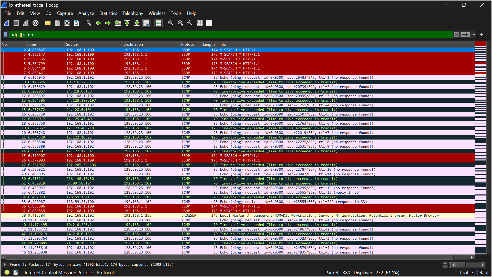
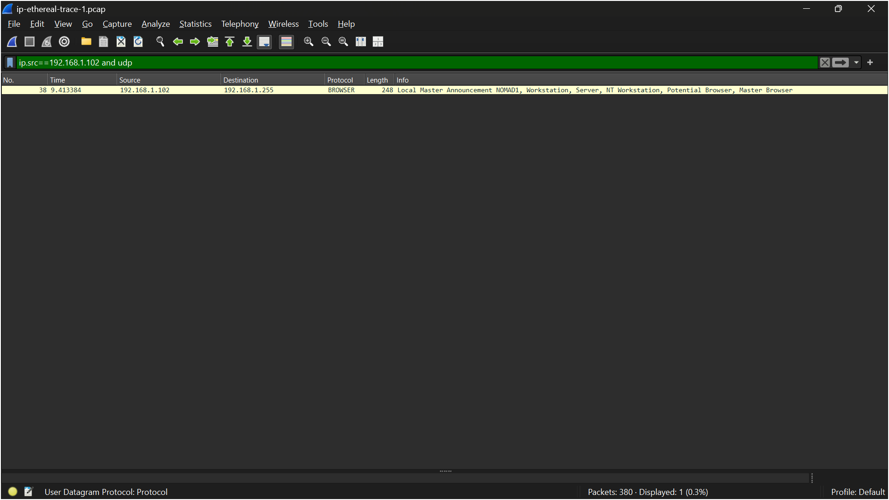

# LAPORAN PRAKTIKUM JARKOM MODUL 10 IP

Nama: Nur Aisyah Luhur Pambudi
Kelas: IF-04-02

## 10.2.1 Bagian 1: IPv4 Dasar 
**Langkah-langkah:**
1. Buka Wireshark dan buka file _"ip-ethereal-trace-1.pcap"_.
2. Lakukan penyaringan dengan mengetik "udp || icmp" pada filter.

    - Pada tahap ini, filter tampilan udp || icmp diterapkan pada Wireshark untuk menampilkan paket UDP dan ICMP yang terdapat pada file ip-ethereal-trace-1.pcap. Hasil penyaringan menampilkan 232 paket dari total 380 paket yang tersedia. Paket-paket yang muncul didominasi oleh ICMP Echo Request, ICMP Time-to-Live Exceeded, dan ICMP Echo Reply yang dihasilkan oleh proses tracert. Terlihat host 192.168.1.102 mengirimkan paket ICMP ke 128.59.23.100 dengan nilai TTL yang meningkat secara bertahap, sedangkan router yang dilewati mengirimkan pesan ICMP Time-to-Live Exceeded kembali ke pengirim ketika nilai TTL mencapai nol. Selain itu terdapat beberapa paket UDP seperti SSDP yang merupakan lalu lintas jaringan lokal dan tidak berkaitan langsung dengan proses traceroute.
3. Lalu lakukan penyaringan lagi dengan mengetik "ip.src==192.168.1.102 and udp" pada filter.

    - Untuk mempelajari paket UDP yang dikirim oleh host sumber, digunakan filter ip.src==192.168.1.102 and udp. Hasil penyaringan menunjukkan hanya satu paket UDP yang berasal dari host tersebut, yaitu paket Browser Service (NetBIOS Browser) yang dikirim ke alamat broadcast 192.168.1.255. Paket ini menggunakan protokol UDP sebagai transport layer dan bukan merupakan bagian dari proses traceroute. Hal ini menunjukkan bahwa file capture yang digunakan berasal dari sistem operasi Windows, di mana perintah tracert menggunakan protokol ICMP Echo Request dan ICMP Time-to-Live Exceeded untuk melakukan pelacakan rute jaringan, bukan menggunakan paket UDP seperti implementasi traceroute pada Linux atau macOS.

## 10.2.3 Bagian 3 IPv6
IPv6 merupakan generasi terbaru dari Internet Protocol yang dikembangkan untuk mengatasi keterbatasan jumlah alamat pada IPv4. Berbeda dengan IPv4 yang menggunakan alamat 32-bit, IPv6 menggunakan alamat 128-bit yang ditulis dalam format heksadesimal sehingga mampu menyediakan ruang alamat yang jauh lebih besar. Selain itu, IPv6 memiliki struktur header yang lebih sederhana dan berukuran tetap sebesar 40 byte, sehingga proses pengolahan paket menjadi lebih efisien. IPv6 juga menggunakan field Hop Limit sebagai pengganti Time To Live (TTL) pada IPv4 serta menghilangkan field Header Checksum untuk mengurangi beban pemrosesan pada router. Dengan berbagai peningkatan tersebut, IPv6 menjadi solusi utama untuk mendukung pertumbuhan perangkat dan kebutuhan komunikasi jaringan modern.