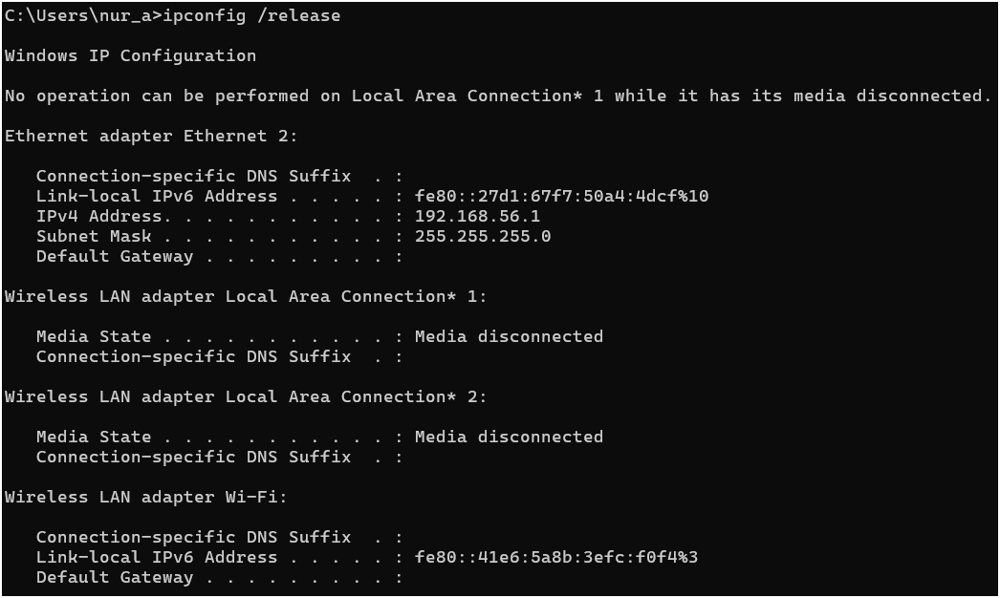
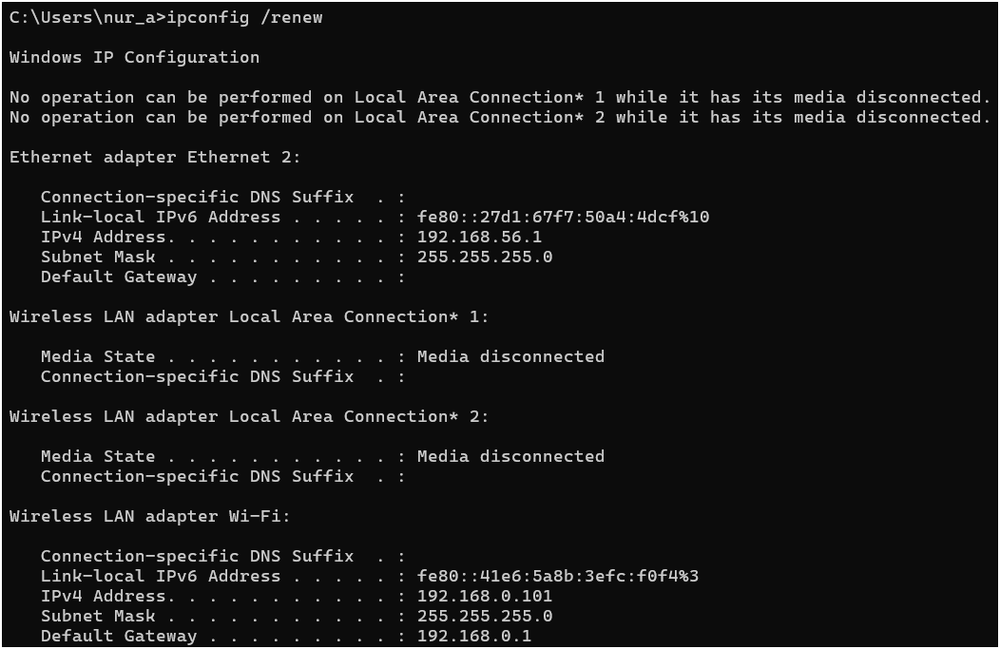
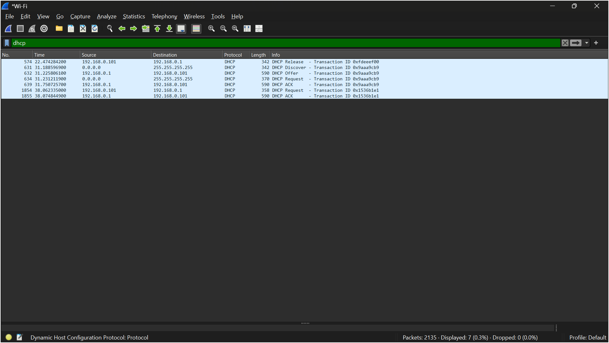
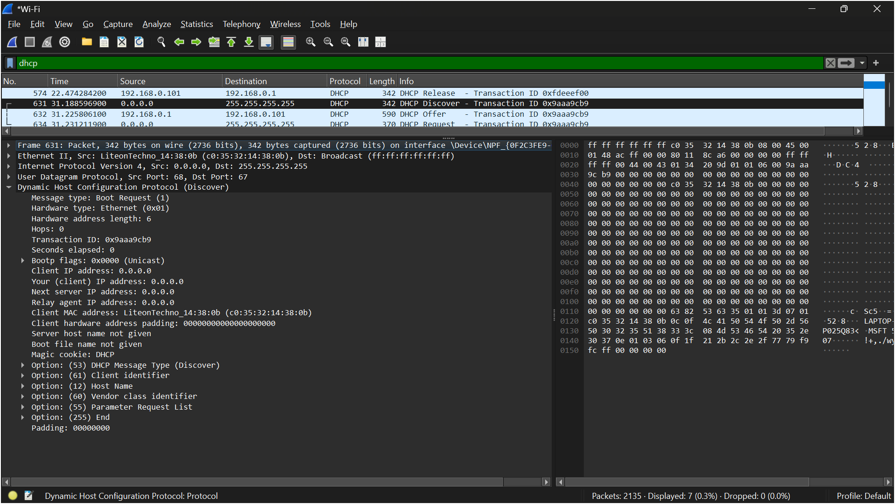
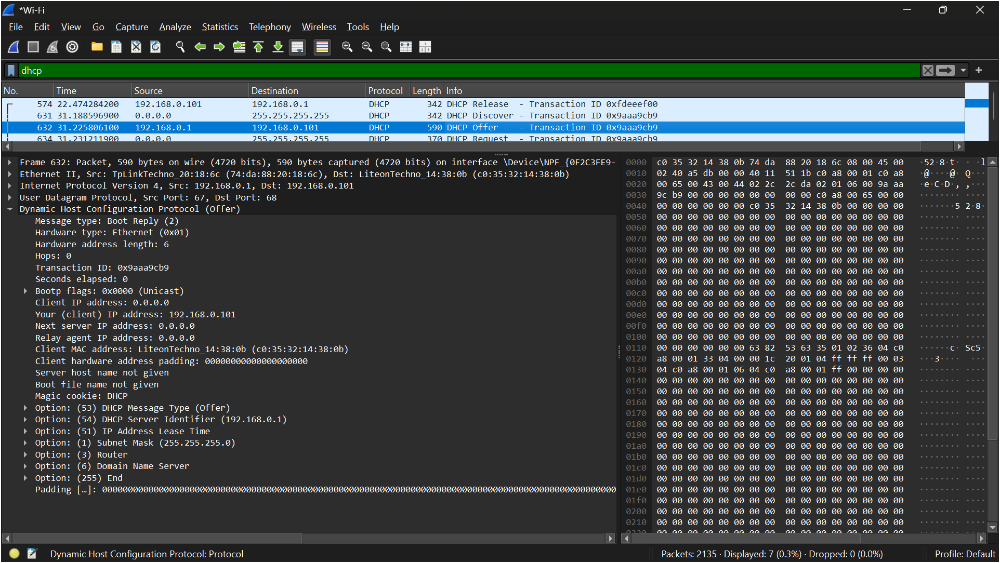
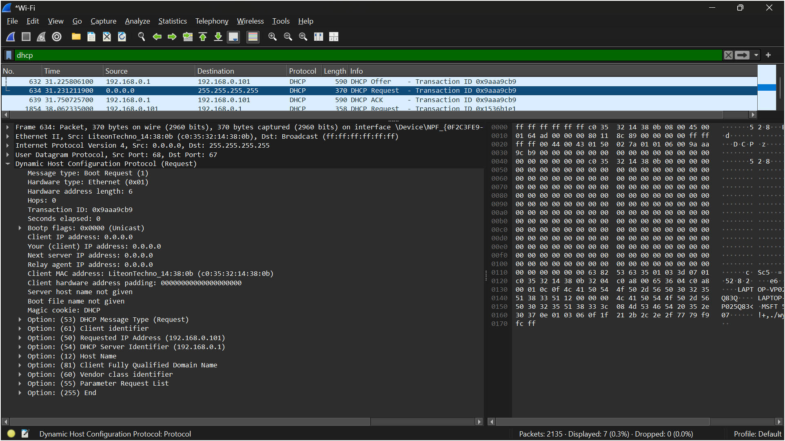
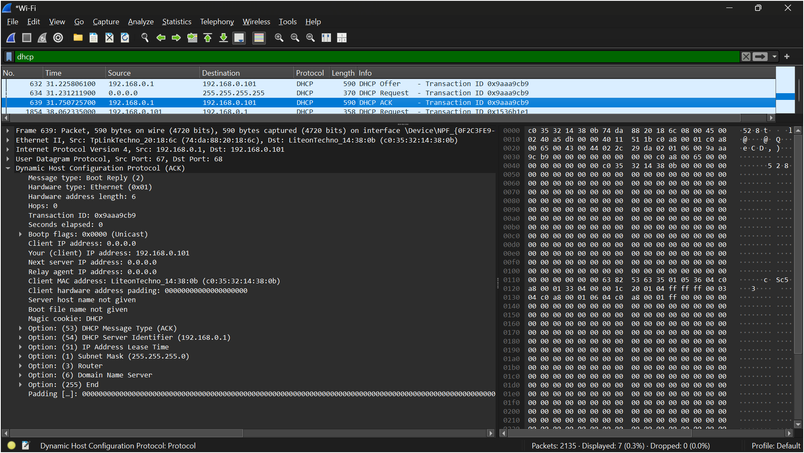

# LAPORAN PRAKTIKUM JARKOM MODUL 11 DHCP

Nama: Nur Aisyah Luhur Pambudi
Kelas: IF-04-02

## 11.2 Mengumpulkan Jejak Paket
**Langkah-langkah:**
1. Buka _"cmd"_ lalu ketik "ipconfig /release".

    - Pada tahap ini dilakukan perintah ipconfig /release untuk melepaskan alamat IP yang sedang digunakan oleh client. Berdasarkan hasil yang terlihat pada Command Prompt, alamat IPv4 pada interface Wi-Fi berhasil dilepaskan sehingga client tidak lagi memiliki alamat IP yang valid. Di Wireshark juga terlihat paket DHCP Release yang dikirim dari client 192.168.0.101 ke server DHCP 192.168.0.1 sebagai pemberitahuan bahwa alamat IP tersebut tidak lagi digunakan.
2. Buka Wireshark dan mulai capturing paket.
3. Kembali ke _"cmd"_, ketik "ipconfig /renew".

    - Setelah alamat IP dilepaskan, dilakukan perintah ipconfig /renew untuk meminta konfigurasi jaringan baru dari server DHCP. Perintah ini memicu proses DHCP sehingga client dapat memperoleh kembali alamat IP, subnet mask, gateway, dan parameter jaringan lainnya secara otomatis. Hasil pada Command Prompt menunjukkan bahwa client kembali memperoleh alamat IP 192.168.0.101 dengan gateway 192.168.0.1.
4. Stop capturing paket.
5. Filter dengan mengetikkan "dhcp". Lalu amati.

## \nAnalisis DHCP DORA
1. DHCP Discover

Pada tahap DHCP Discover, client mengirimkan pesan broadcast ke alamat 255.255.255.255 untuk mencari server DHCP yang tersedia pada jaringan. Pada paket yang ditangkap Wireshark terlihat sumber alamat IP masih 0.0.0.0 karena client belum memiliki alamat IP. Pesan ini merupakan langkah awal dalam proses DORA untuk menemukan server DHCP yang dapat memberikan konfigurasi jaringan.
2. DHCP Offer

Setelah menerima DHCP Discover, server DHCP merespons dengan mengirimkan DHCP Offer kepada client. Paket ini berisi penawaran alamat IP yang dapat digunakan oleh client beserta informasi konfigurasi jaringan lainnya. Pada hasil tangkapan terlihat server 192.168.0.1 menawarkan alamat IP 192.168.0.101 kepada client serta menyertakan informasi seperti subnet mask, router (gateway), DNS server, dan lease time.
3. DHCP Request

Setelah menerima penawaran dari server, client mengirimkan DHCP Request untuk menyatakan bahwa alamat IP yang ditawarkan akan digunakan. Pada paket ini terlihat client meminta alamat 192.168.0.101 dan mengidentifikasi server DHCP 192.168.0.1 sebagai server yang dipilih. Tahap ini berfungsi sebagai konfirmasi bahwa client menerima penawaran yang diberikan oleh server DHCP.
4. DHCP ACK

Tahap terakhir dalam proses DORA adalah DHCP ACK (Acknowledgement). Pada tahap ini server DHCP mengonfirmasi bahwa alamat IP yang diminta telah resmi diberikan kepada client. Paket ACK berisi informasi konfigurasi jaringan yang akan digunakan, seperti alamat IP 192.168.0.101, subnet mask 255.255.255.0, default gateway, DNS server, dan lease time. Setelah menerima DHCP ACK, client dapat mulai menggunakan alamat IP tersebut untuk berkomunikasi dalam jaringan.