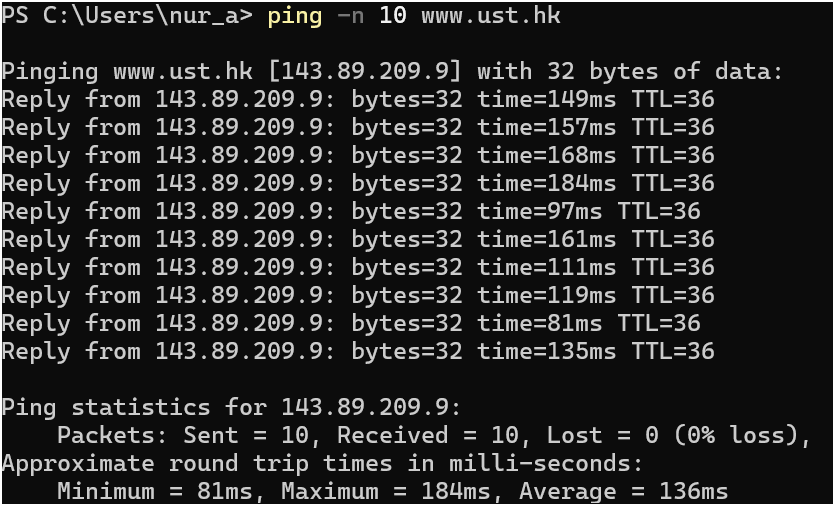
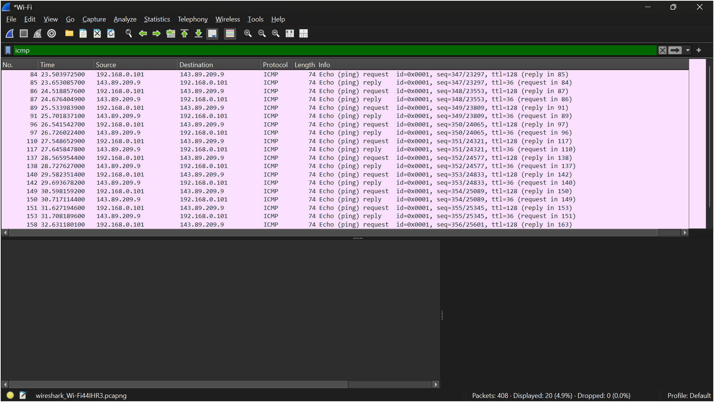
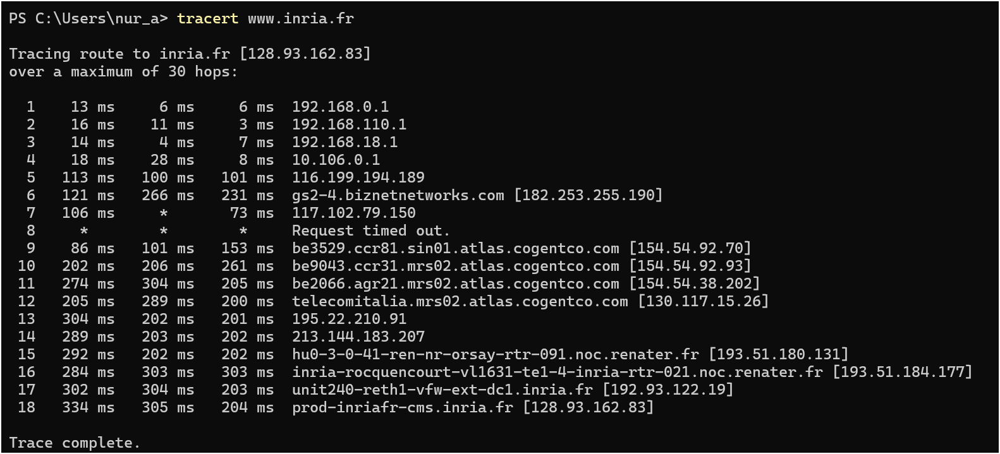
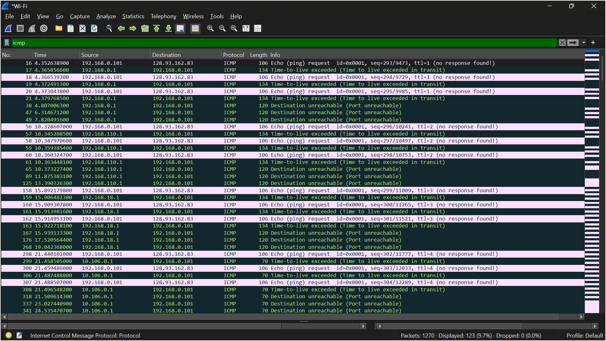

# LAPORAN PRAKTIKUM JARKOM MODUL 12 ICMP

Nama: Nur Aisyah Luhur Pambudi
Kelas: IF-04-02

## 12.2 ICMP dan Ping
**Langkah-langkah:**
1. Buka _"Windows Command Prompt "_.
2. Buka Wireshark dan mulai capturing paket.
3. Kembali ke Windows Command Prompt ketik "ping -n 10 www.ust.hk" dan tunggu selesai.
4. Jika sudah, stop capturing.
5. Filter "icmp"

**Hasil:**
1. "ping -n 10 www.ust.hk"

Pada percobaan ini dilakukan perintah ping -n 10 www.ust.hk untuk mengirimkan 10 paket ICMP Echo Request ke server www.ust.hk (143.89.209.9) yang berada di Hong Kong. Hasil pengujian menunjukkan bahwa seluruh 10 paket berhasil diterima kembali dengan 0% packet loss, menandakan bahwa host tujuan aktif dan dapat dijangkau melalui jaringan. Waktu Round Trip Time (RTT) yang diperoleh bervariasi antara 81 ms hingga 184 ms dengan rata-rata 136 ms, yang menunjukkan waktu yang dibutuhkan paket untuk pergi ke tujuan dan kembali ke host pengirim.
2. Filter "icmp"

Setelah filter icmp diterapkan pada Wireshark, terlihat paket ICMP Echo Request yang dikirim dari host lokal 192.168.0.101 menuju 143.89.209.9 serta paket ICMP Echo Reply yang dikirim kembali oleh host tujuan. Jumlah paket yang tampil adalah 20 paket, terdiri dari 10 Echo Request dan 10 Echo Reply sesuai dengan perintah ping -n 10. Pada kolom informasi terlihat nilai TTL sebesar 128 pada paket request dan TTL sebesar 36 pada paket reply. Hasil ini membuktikan bahwa protokol ICMP digunakan oleh program Ping untuk menguji konektivitas jaringan dan mengukur waktu tempuh paket antara host sumber dan host tujuan.

## 12.3 ICMP dan Traceroute
**Langkah-langkah:**
1. Buka _"Windows Command Prompt "_.
2. Buka Wireshark dan mulai capturing paket.
3. Kembali ke Windows Command Prompt ketik "tracert www.inria.fr" dan tunggu selesai.
4. Jika sudah, stop capturing.
5. Filter "icmp"

**Hasil:**
1. "tracert www.inria.fr"

Pada percobaan ini digunakan perintah tracert www.inria.fr untuk mengetahui jalur yang dilalui paket dari host lokal menuju server www.inria.fr (128.93.162.83) di Prancis. Hasil traceroute menunjukkan bahwa paket melewati 18 hop sebelum mencapai tujuan. Untuk setiap hop, program mengirimkan tiga paket probe dan menampilkan nilai Round Trip Time (RTT) yang berbeda-beda. Beberapa hop menampilkan pesan Request timed out, yang menunjukkan router pada hop tersebut tidak mengirimkan balasan ICMP atau memblokir paket traceroute. Meskipun demikian, proses traceroute tetap dapat melanjutkan pelacakan hingga mencapai host tujuan dan menampilkan jalur jaringan yang dilalui paket dari sumber ke tujuan.
2. Filter "icmp"

Setelah filter icmp diterapkan pada Wireshark, terlihat paket ICMP Echo Request yang dikirim dari host 192.168.0.101 menuju 128.93.162.83 dengan nilai TTL yang meningkat secara bertahap, mulai dari TTL=1, TTL=2, TTL=3, dan seterusnya. Ketika nilai TTL habis di suatu router, router tersebut mengirimkan pesan ICMP Time-to-Live Exceeded kembali ke host sumber, sehingga alamat router pada setiap hop dapat diketahui. Pada hasil capture juga terlihat beberapa pesan Destination Unreachable, yang merupakan respons ICMP ketika paket tidak dapat diteruskan ke tujuan tertentu. Hasil ini menunjukkan cara kerja traceroute pada Windows yang memanfaatkan paket ICMP untuk mengidentifikasi setiap router yang dilalui hingga mencapai host tujuan.