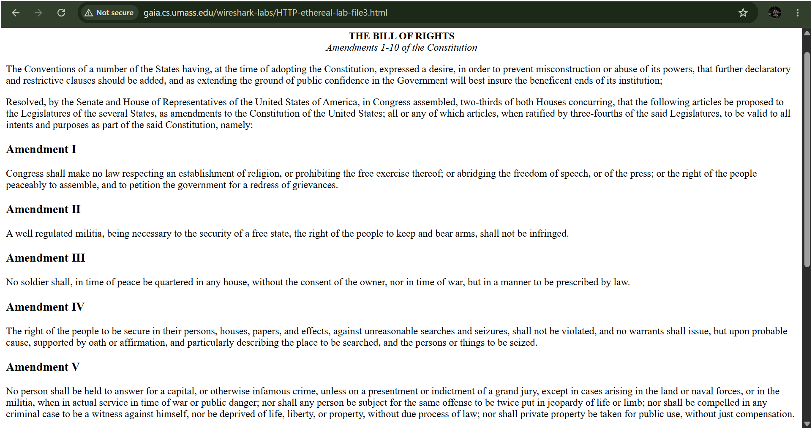
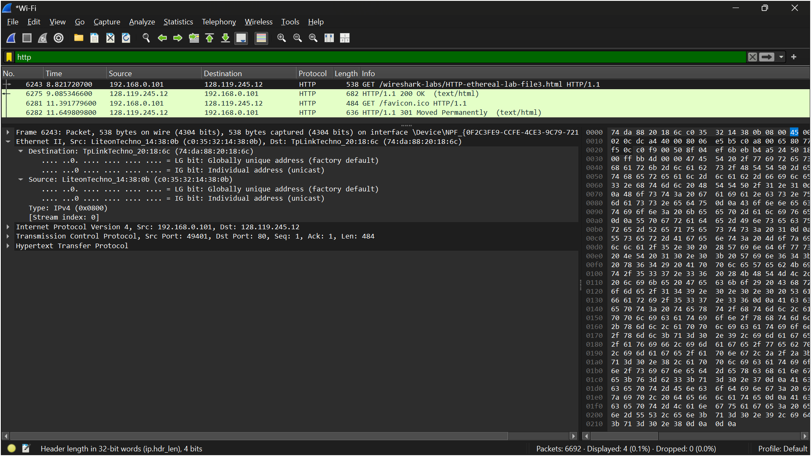
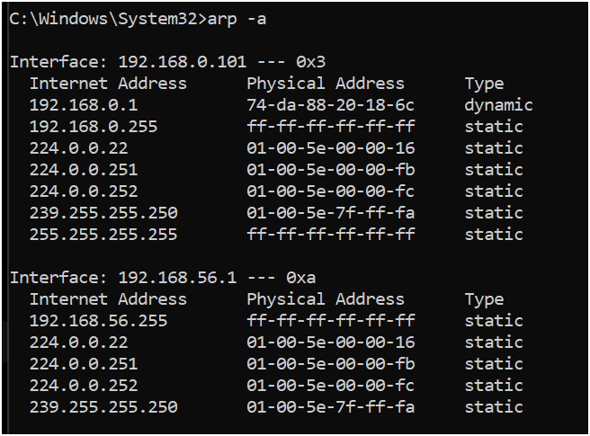
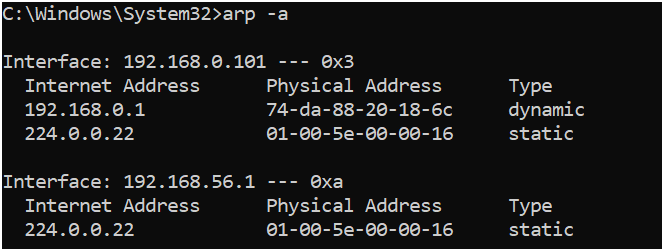
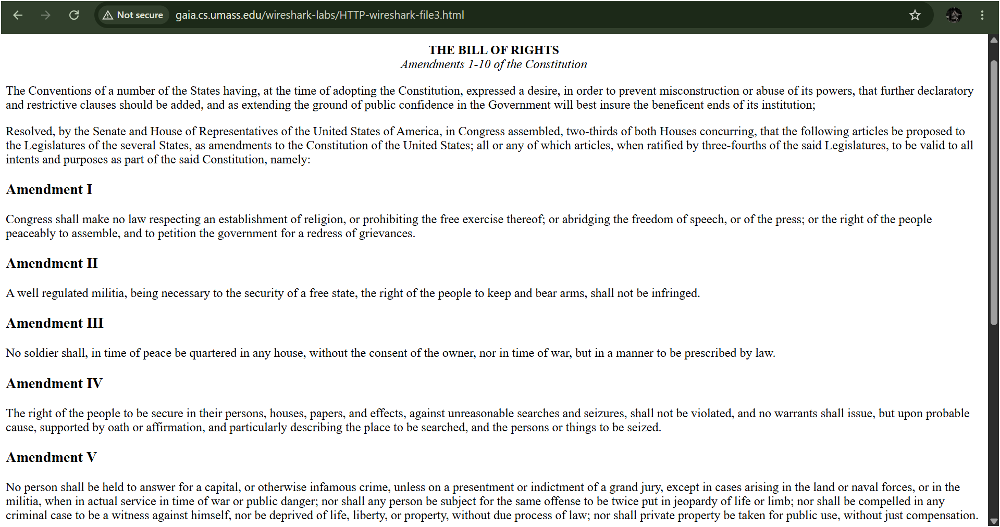
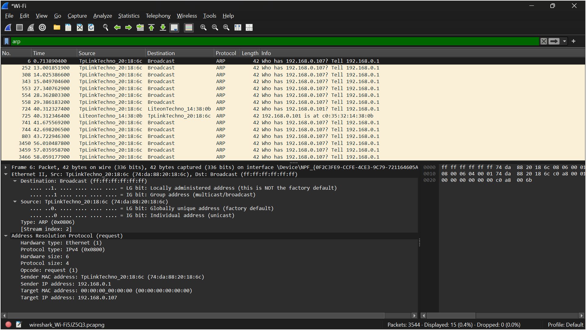

# LAPORAN PRAKTIKUM JARKOM MODUL 13 ETHERNET & ARP

Nama: Nur Aisyah Luhur Pambudi
Kelas: IF-04-02

## 13.2 Menangkap dan menganalisis frame Ethernet
**Langkah-langkah:**
1. Buka Wireshark dan mulai capturing paket.
2. Buka URL _"http://gaia.cs.umass.edu/wireshark-labs/HTTP-wireshark-file3.html"_.

    - Setelah halaman berhasil dimuat, browser menampilkan dokumen The Bill of Rights yang berisi Amendemen 1–10 Konstitusi Amerika Serikat. Akses halaman ini menghasilkan pertukaran paket HTTP antara komputer klien dan server gaia.cs.umass.edu yang kemudian dapat diamati menggunakan Wireshark untuk menganalisis frame Ethernet yang membawa data tersebut.
3. Stop capturing paket.
4. Gunakan filter "http"

    - Hasil capture Wireshark menunjukkan proses komunikasi HTTP antara host lokal 192.168.0.101 dan server 128.119.245.12 (gaia.cs.umass.edu). Terlihat paket HTTP GET yang dikirim klien untuk meminta file HTTP-ethereal-lab-file3.html, kemudian server merespons dengan HTTP/1.1 200 OK yang menandakan permintaan berhasil diproses. Pada panel detail paket juga terlihat informasi Ethernet II yang memuat alamat MAC sumber dan tujuan, menunjukkan bahwa setiap komunikasi HTTP sebenarnya dikirim melalui frame Ethernet pada lapisan data link sebelum diproses oleh protokol yang lebih tinggi seperti IP, TCP, dan HTTP.

## 13.3.1 Caching ARP
**Langkah-langkah:**
1. Buka Command Prompt.
2. Ketik "arp -a".
3. Setelah selesai, ketik "arpp -d *".
4. Ketik kembali "arp -a".

**Hasil:**

- Terdapat entri dinamis yang memetakan alamat IP 192.168.0.1 ke alamat MAC 74-da-88-20-18-6c. Entri ini menunjukkan bahwa komputer telah berkomunikasi dengan gateway/router sehingga pasangan alamat IP dan alamat fisik tersebut disimpan sementara di cache ARP untuk mempercepat proses komunikasi berikutnya. Selain itu, terdapat beberapa entri bertipe static seperti alamat multicast dan broadcast yang digunakan untuk kebutuhan komunikasi jaringan tertentu.

- Pada tahap ini dilakukan penghapusan seluruh entri ARP cache menggunakan perintah arp -d *. Perintah tersebut menghapus entri ARP dinamis yang tersimpan pada komputer sehingga ketika perangkat kembali berkomunikasi dengan host lain, sistem harus melakukan proses ARP Request dan ARP Reply untuk memperoleh alamat MAC tujuan. Langkah ini dilakukan agar aktivitas ARP dapat diamati secara langsung melalui Wireshark.

- Setelah perintah penghapusan dijalankan, isi ARP cache diperiksa kembali menggunakan arp -a. Terlihat bahwa entri dinamis untuk gateway sudah tidak ada lagi dan yang tersisa hanya beberapa entri bertipe static seperti alamat multicast dan broadcast. Hal ini menunjukkan bahwa proses penghapusan ARP cache berhasil dilakukan. Ketika komputer kembali mengakses jaringan, entri dinamis akan dibuat ulang melalui mekanisme ARP untuk memperoleh alamat MAC perangkat tujuan.

## 13.3.2 Mengamati Aksi ARP
**Langkah-langkah:**
1. Melanjutkan dari "13.3.1", buka Wireshark dan mulai capturing paket.
2. Buka URL _"http://gaia.cs.umass.edu/wireshark-labs/HTTP-ethereal-lab-file3.html"_.

    - Pada tahap ini browser mengakses URL http://gaia.cs.umass.edu/wireshark-labs/HTTP-wireshark-file3.html dan berhasil menampilkan halaman The Bill of Rights. Ketika komputer mengakses server web tersebut, perangkat perlu mengetahui alamat MAC dari gateway jaringan agar paket dapat diteruskan ke tujuan. Karena cache ARP sebelumnya telah dikosongkan, komputer harus menjalankan proses ARP terlebih dahulu untuk memperoleh informasi alamat fisik perangkat tujuan.
3. Stop capturing paket.
4. Gunakan filter "arp".

    - Hasil capture Wireshark menunjukkan adanya pertukaran paket ARP pada jaringan lokal. Terlihat paket ARP Request dengan informasi "Who has 192.168.0.101? Tell 192.168.0.1" yang dikirim secara broadcast oleh perangkat gateway. Setelah itu muncul paket ARP Reply dengan informasi "192.168.0.101 is at c0:35:32:14:38:0b", yang menunjukkan bahwa host dengan alamat IP 192.168.0.101 mengirimkan alamat MAC miliknya kepada gateway. Proses ini memungkinkan perangkat dalam jaringan mengetahui pasangan alamat IP dan alamat MAC sehingga komunikasi data dapat berlangsung dengan benar pada lapisan Ethernet.

**Kesimpulan:**
Berdasarkan hasil pengamatan, protokol ARP bekerja dengan cara mengirimkan ARP Request secara broadcast untuk mencari alamat MAC dari suatu alamat IP. Perangkat yang memiliki alamat IP tersebut kemudian membalas menggunakan ARP Reply yang berisi alamat MAC miliknya. Informasi ini selanjutnya disimpan pada ARP cache sehingga komunikasi berikutnya dapat dilakukan tanpa perlu mengirimkan ARP Request kembali selama entri cache masih tersedia.