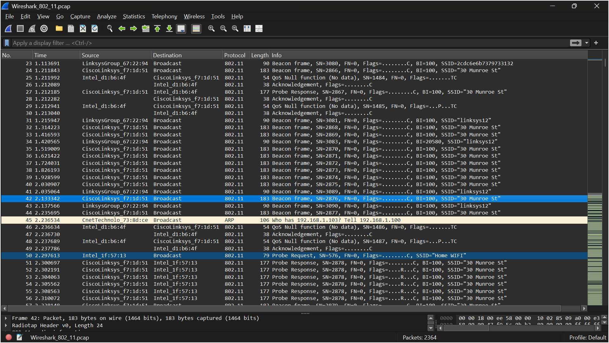
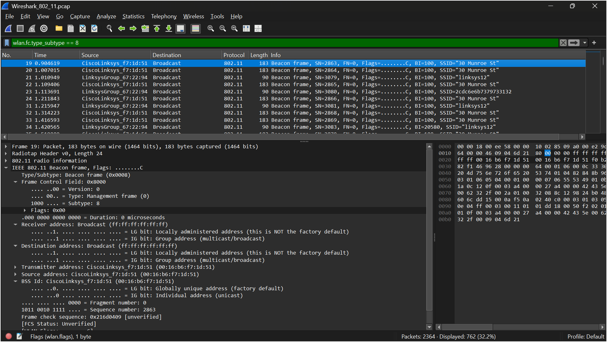
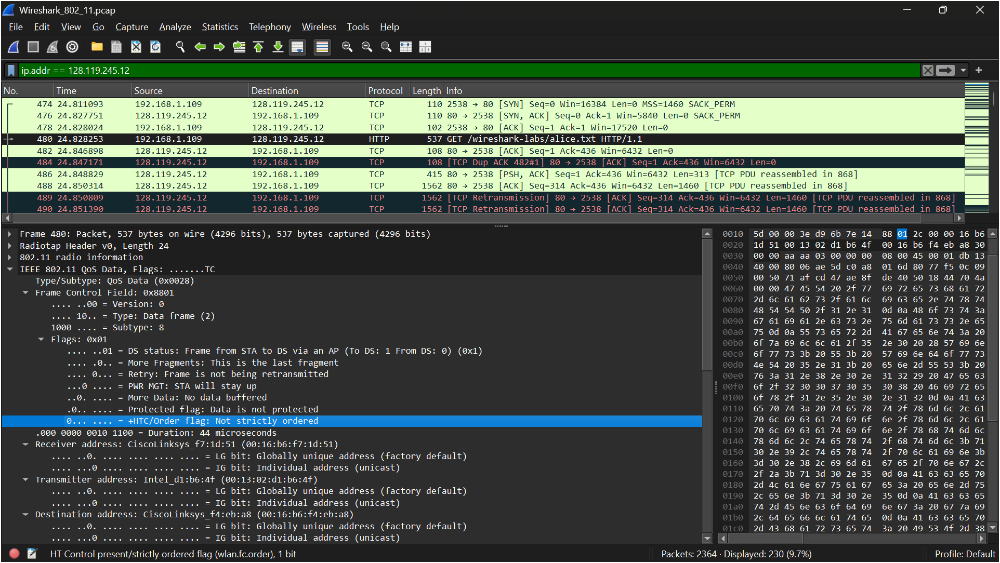
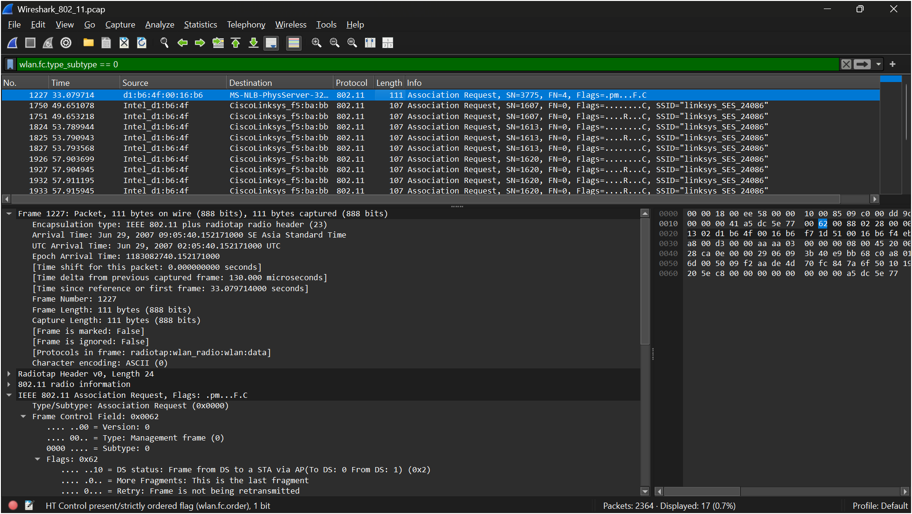
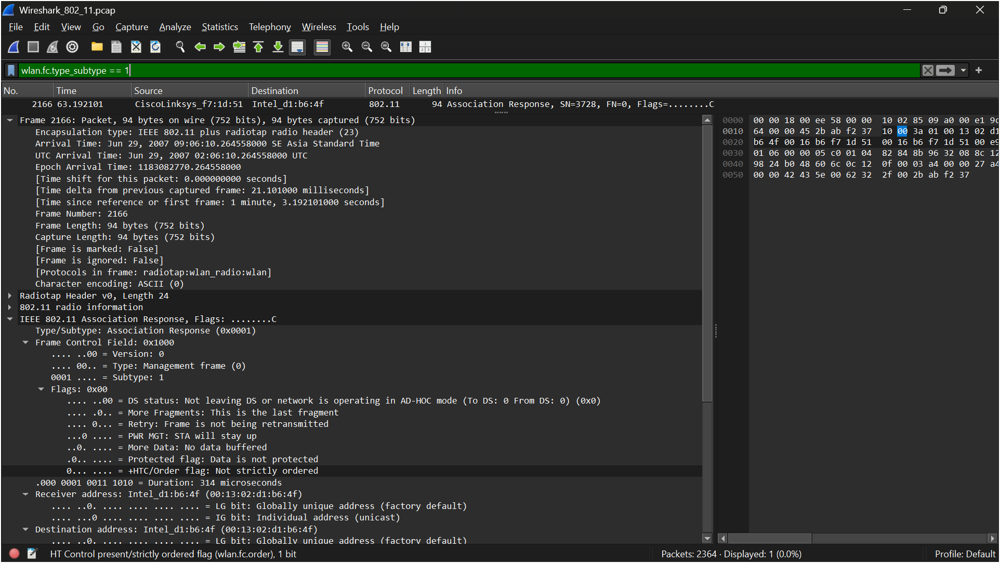

# LAPORAN PRAKTIKUM JARKOM MODUL 14  802.11 WIFI

Nama: Nur Aisyah Luhur Pambudi
Kelas: IF-04-02

## Langkah-langkah:
1. Undul file zip wireshark-traces.zip yang ada di modul.
2. Ekstrak file "Wireshark_802_11".
3. Buka file menggunakan WIreshark

    - Hasil capture menampilkan berbagai frame pada jaringan IEEE 802.11, seperti Beacon Frame, Probe Request, Probe Response, Acknowledgement, dan ARP. Beacon Frame dengan SSID "30 Munroe St" dan "linksys12" menunjukkan bahwa kedua access point tersebut secara berkala mengirimkan informasi identitas jaringan kepada perangkat di sekitarnya. Selain itu, terdapat Probe Request dari perangkat klien untuk mencari jaringan Wi-Fi yang tersedia, kemudian diikuti Probe Response dari access point sebagai balasan yang berisi informasi jaringan yang dapat dihubungkan. Hal ini menunjukkan adanya aktivitas komunikasi dan penemuan jaringan nirkabel pada hasil capture.
4. Analisis Beacon Frame pada jaringan WiFi di wireshark.
5. Analisis transfer data yang terjadi melalui jaringan 802.11
6. Mengamati proses Association dan Disassociation (antara host dan ap atau access point)

## Hasil

Hasil filter wlan.fc.type_subtype == 8 menampilkan seluruh Beacon Frame yang dikirim secara berkala oleh access point. Pada paket yang dipilih terlihat SSID "30 Munroe St" dengan Subtype: Beacon Frame (0x0008), yang menunjukkan bahwa frame tersebut merupakan frame manajemen IEEE 802.11. Beacon Frame dikirim secara broadcast untuk mengumumkan keberadaan access point beserta informasi jaringan, seperti SSID, sehingga perangkat nirkabel di sekitarnya dapat mendeteksi dan mengenali jaringan Wi-Fi yang tersedia. Selain SSID "30 Munroe St", hasil capture juga menampilkan Beacon Frame dari access point lain, seperti "linksys12", yang menunjukkan adanya beberapa jaringan nirkabel pada area yang sama.

Terlihat proses komunikasi antara host 192.168.1.109 dengan server 128.119.245.12. Pada urutan paket terlihat TCP Three-Way Handshake yang terdiri dari SYN, SYN-ACK, dan ACK sebagai proses pembentukan koneksi. Setelah koneksi berhasil dibangun, host mengirimkan HTTP GET /wireshark-labs/alice.txt HTTP/1.1 untuk meminta file kepada server. Server kemudian memberikan ACK dan mengirimkan data menggunakan paket PSH, ACK. Selain itu, juga terlihat beberapa paket TCP Retransmission yang menandakan adanya pengiriman ulang segmen TCP karena belum menerima konfirmasi (ACK) dari penerima.

Terlihat beberapa Association Request yang dikirim oleh host Intel_d1:b6:4f menuju access point CiscoLinksys_f5:ba:bb dengan SSID "linksys_SES_24086". Frame ini merupakan permintaan dari perangkat klien untuk bergabung (associate) ke access point. Pada detail paket terlihat Type = Management frame (0) dan Subtype = Association Request (0), yang menandakan bahwa paket tersebut merupakan frame manajemen 802.11 yang digunakan dalam proses pembentukan koneksi ke access point. Munculnya beberapa Association Request menunjukkan bahwa klien berulang kali mencoba melakukan asosiasi dengan access point tersebut, namun belum berhasil mendapatkan respons yang menandakan koneksi berhasil terbentuk.

Terlihat sebuah Association Response yang dikirim oleh access point CiscoLinksys_f7:1d:51 kepada host Intel_d1:b6:4f. Frame ini merupakan balasan atas Association Request yang sebelumnya dikirim oleh klien sebagai bagian dari proses pembentukan koneksi. Pada detail paket terlihat Type = Management frame (0) dan Subtype = Association Response (1), yang menunjukkan bahwa access point memberikan respons terhadap permintaan asosiasi dari klien. Munculnya frame ini menandakan bahwa proses asosiasi telah mendapatkan balasan dari access point sehingga klien dapat melanjutkan proses komunikasi pada jaringan nirkabel.