# LAPORAN PRAKTIKUM JARKOM MODUL 4 DNS

Nama: Nur Aisyah Luhur Pambudi
Kelas: IF-04-02

## 4.2 Nslookup
**Pertanyaan:**
1. Jalankan nslookup untuk mendapatkan alamat IP dari server web di Asia. Berapa alamat IP server tersebut?
2. Jalankan nslookup agar dapat mengetahui server DNS otoritatif untuk universitas di Eropa.
3. Jalankan nslookup untuk mencari tahu informasi mengenai server email dari Yahoo! Mail melalui salah satu server yang didapatkan di pertanyaan nomor 2. Apa alamat IP-nya?

**Jawaban:**
1. Dari pengujian yang dilakukan dihasilkan:
    - Tujuan: Mengetahui alamat IP dari server web di wilayah Asia menggunakan perintah nslookup.
    - Hasil:Domain *www.kompas.com* berhasil diterjemahkan menjadi beberapa alamat IP yaitu 13.35.1.33, 13.35.1.68, 13.35.1.20, dan 13.35.1.60. Domain tersebut merupakan website berbasis di Indonesia sehingga termasuk dalam wilayah Asia.
    - DNS Resolver: Permintaan diproses melalui DNS resolver lokal dengan alamat 192.168.0.1.

2. Berdasarkan pengujian menggunakan perintah nslookup -type=NS cam.ac.uk, didapatkan informasi sebagai berikut:
    - Identifikasi Server Otoritatif: Terdapat beberapa name server yang mengelola domain cam.ac.uk, di antaranya auth0.dns.cam.ac.uk, auth1.dns.cam.ac.uk, dns0.eng.cam.ac.uk, dns0.cl.cam.ac.uk, ns1.mythic-beasts.com, ns3.mythic-beasts.com, dan ns2.ic.ac.uk.
    - Alamat IP Server (IPv4):Beberapa server memiliki alamat IPv4 seperti 131.111.8.37, 131.111.12.37, 128.232.0.19, 129.169.8.8, serta alamat lain dari server eksternal seperti 45.33.127.156 dan 185.244.221.32.
    - Dukungan Dual-Stack (IPv6): Server DNS mendukung IPv6 yang ditunjukkan dengan adanya alamat IPv6 seperti 2001:630:212:8::a0 dan lainnya.
    - DNS Resolver Lokal: Permintaan DNS diproses melalui DNS resolver lokal dengan alamat 192.168.0.1.

3. Dari pengujian yang dilakukan dihasilkan:
    - Server yang digunakan: Server DNS yang digunakan adalah auth0.dns.cam.ac.uk dengan alamat IP 131.111.8.37.
    - Masalah: Permintaan query terhadap domain yahoo.com berhasil diproses dan menghasilkan informasi mail server Yahoo tanpa mengalami error.
    - Penyebab: Hal ini terjadi karena server DNS tersebut mampu merespon permintaan dan memberikan informasi Mail Exchange (MX) dari domain yahoo.com, seperti mta6.am0.yahoodns.net, mta7.am0.yahoodns.net, dan mta5.am0.yahoodns.net. Server DNS tersebut dapat melakukan resolusi domain meskipun domain yang diminta berada di luar otoritasnya.

## 4.3 Ipconfig
**Langkah-langkah:**
1. Ketik ipconfig nanti akan menampilkan informasi konfigurasi jaringan pada komputer. Terdapat IPv4 Address yaitu alamat IP yang digunakan oleh perangkat dalam jaringan, Subnet Mask, serta Default Gateway yang digunakan untuk menghubungkan ke jaringan lain.
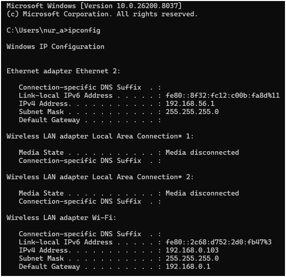
2. Ketik ipconfig /all nanti akan menampilkan informasi jaringan secara lengkap, meliputi IPv4 Address, Physical Address (MAC Address), DNS Server, DHCP Server, serta informasi detail lainnya terkait konfigurasi jaringan yang digunakan oleh komputer.
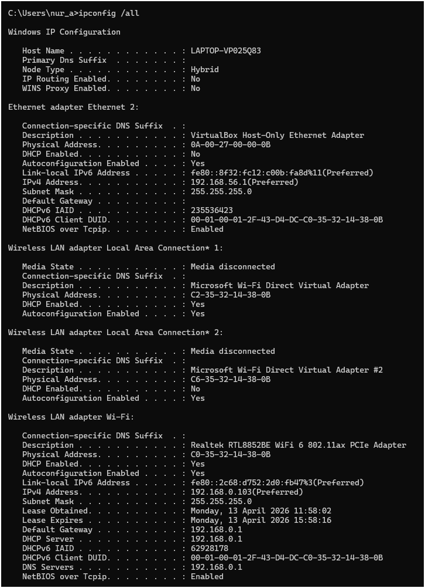
3. Ketik ipconfig /displaydns nanti akan menampilkan daftar cache DNS yang tersimpan pada komputer, yaitu kumpulan domain yang sebelumnya pernah diakses beserta alamat IP-nya sehingga proses akses menjadi lebih cepat tanpa harus melakukan query ulang ke server DNS.
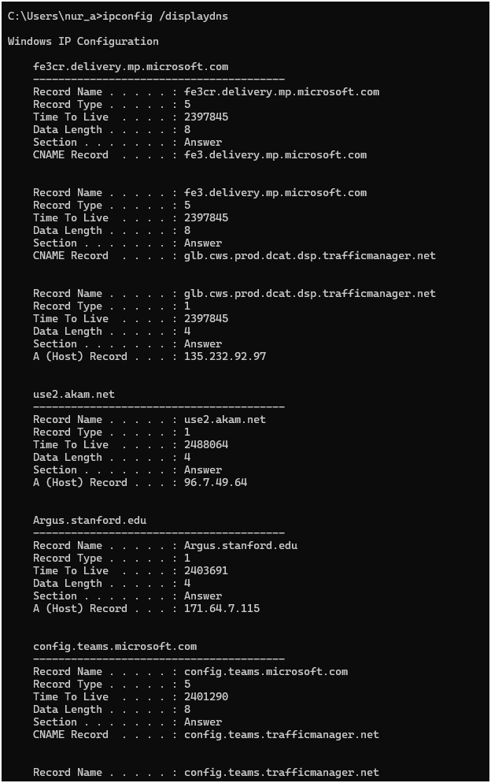
4. Ketik ipconfig /flushdns nanti akan menghapus seluruh cache DNS yang tersimpan pada komputer, sehingga sistem akan melakukan query ulang ke server DNS untuk mendapatkan informasi terbaru.
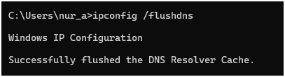

## 4.4 Tracing DNS dengan Wireshark
**Langkah-langkah percobaan 1:**
1. Gunakan ipconfig untuk mengosongkan catatan DNS di host.
2. Kosongkan cache browser, bisa dengan Ctrl+Shift+Del.
3. Buka Wireshark dan masukkan "ip.addr == <your_IP_address>" ke dalam filter. Contoh: "ip.addr == 192.168.0.103". Filter ini akan menghapus semua paket yang tidak berasal atau ditujukan ke host.
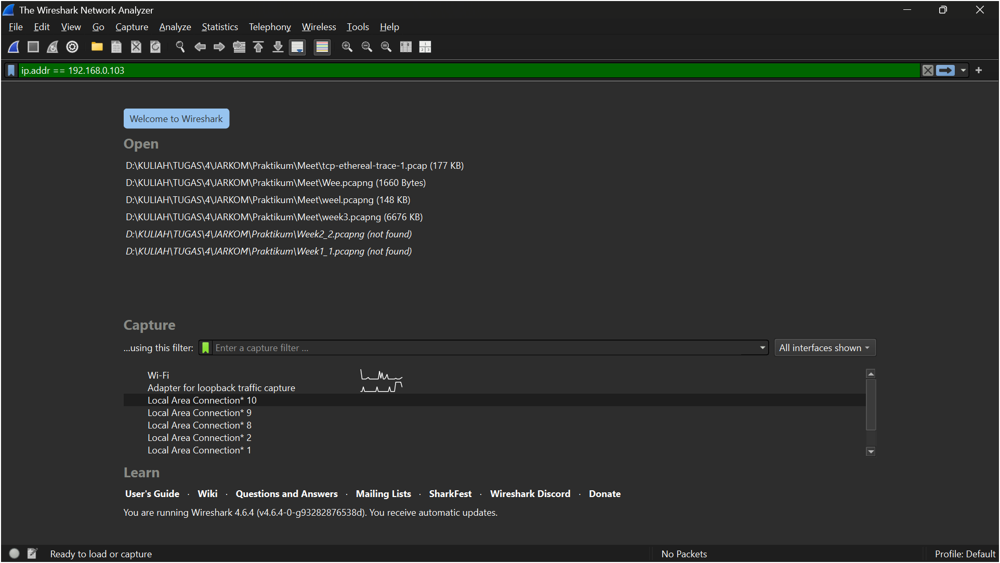
4. Mulai capture paket.
5. Buka URL *http://www.ietf.org*

6. Stop capturing.
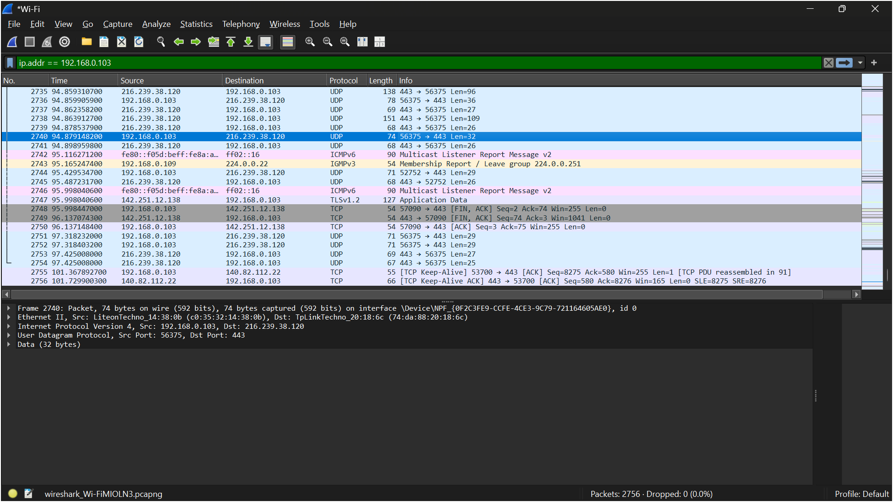

**Pertanyaan:**
1. Cari pesan permintaan DNS dan balasannya. Apakah pesan tersebut dikirimkan melalui UDP atau TCP?
    - Jawab: Berdasarkan hasil tangkapan Wireshark, pesan permintaan DNS (DNS query) dan pesan balasannya (DNS response) dikirimkan menggunakan protokol UDP (User Datagram Protocol). Hal ini terlihat pada bagian detail paket yang menunjukkan bahwa komunikasi DNS menggunakan UDP dengan destination port 53, yang merupakan port standar untuk layanan DNS. Dengan demikian, dapat disimpulkan bahwa proses query dan response DNS pada percobaan ini menggunakan protokol UDP, bukan TCP.
    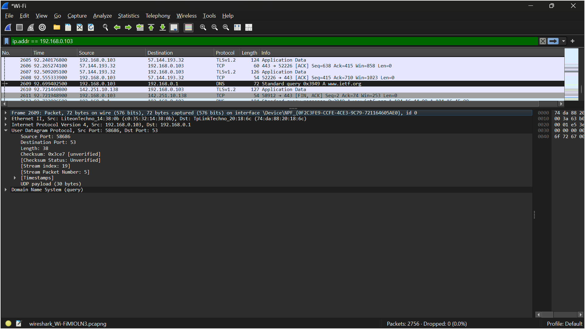
2. Apa port tujuan pada pesan permintaan DNS? Apa port sumber pada pesan balasannya?
    - Jawab: Berdasarkan hasil analisis pada Wireshark, port tujuan pada pesan permintaan DNS (DNS query) adalah port 53, yang merupakan port standar yang digunakan oleh server DNS untuk menerima permintaan. Sementara itu, port sumber pada pesan balasan DNS (DNS response) juga berasal dari port 53, karena balasan dikirim oleh server DNS tersebut. Dengan demikian, dapat disimpulkan bahwa komunikasi DNS menggunakan port 53 sebagai port utama pada sisi server, baik untuk menerima permintaan maupun mengirimkan balasan.
    
3. Pada pesan permintaan DNS, apa alamat IP tujuannya? Apa alamat IP server DNS lokal anda (gunakan ipconfig untuk mencari tahu)? Apakah kedua alamat IP tersebut sama?
    - Jawab: Berdasarkan hasil tangkapan Wireshark pada paket DNS query, alamat IP tujuan yang digunakan adalah 192.168.0.1, yang merupakan alamat IP dari server DNS lokal. Sementara itu, berdasarkan hasil perintah ipconfig, alamat IP DNS server lokal juga adalah 192.168.0.1. Dengan demikian, dapat disimpulkan bahwa alamat IP tujuan pada pesan permintaan DNS sama dengan alamat IP server DNS lokal yang digunakan oleh host.
    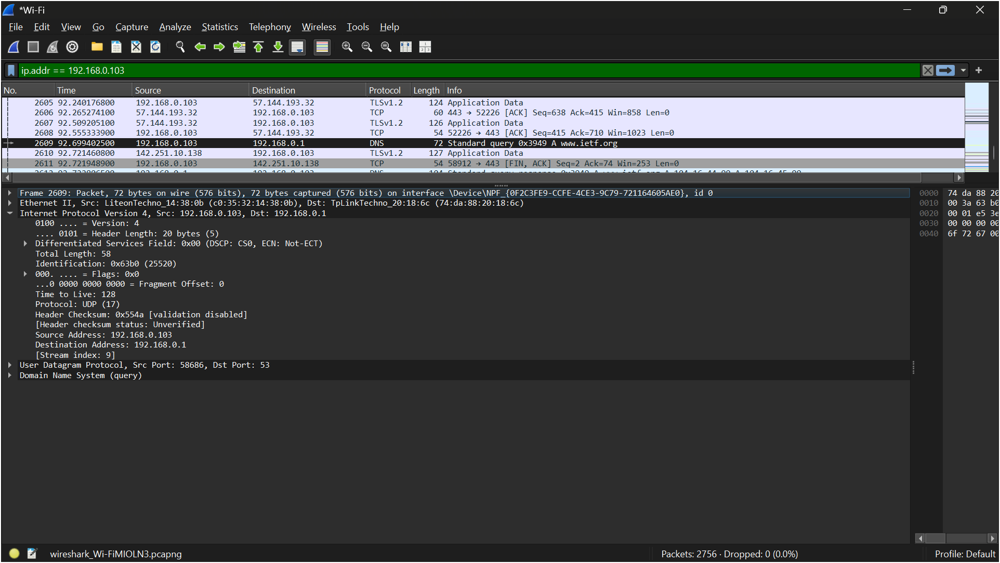
4. Periksa pesan permintaan DNS. Apa “jenis” atau ”type” dari pesan tersebut? Apakah pesan permintaan tersebut mengandung ”jawaban” atau ”answers”?
    - Jawab: Berdasarkan hasil analisis pada pesan permintaan DNS (DNS query) di Wireshark, jenis (type) dari pesan tersebut adalah type A, yang digunakan untuk meminta alamat IP (IPv4) dari suatu domain, dalam hal ini www.ietf.org. Selain itu, pada bagian DNS query terlihat bahwa tidak terdapat jawaban (answers = 0), karena pesan tersebut merupakan permintaan dari client ke server DNS. Dengan demikian, dapat disimpulkan bahwa DNS query hanya berisi pertanyaan tanpa mengandung jawaban.
    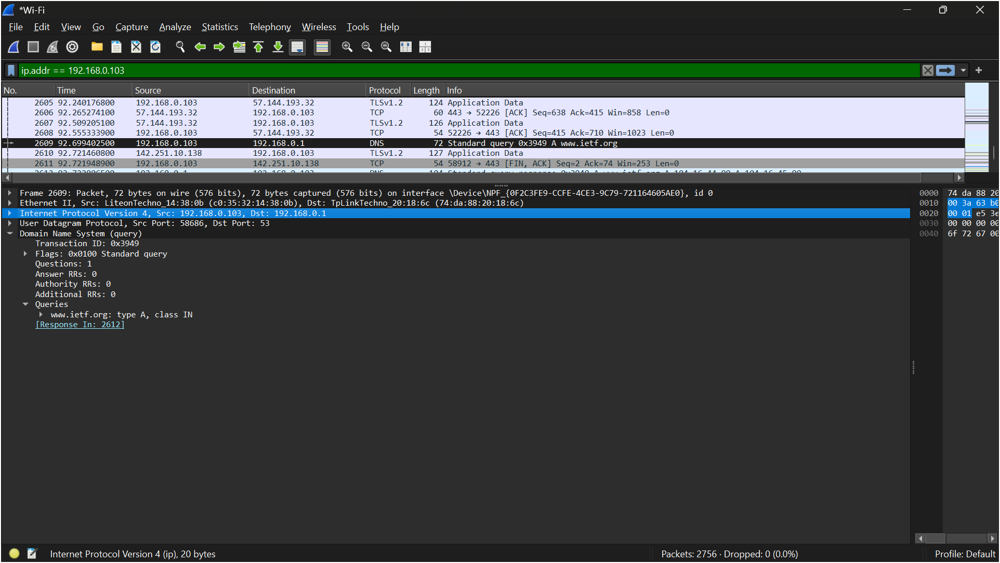
5. Periksa pesan balasan DNS. Berapa banyak ”jawaban” atau ”answers” yang terdapat di dalamnya? Apa saja isi yang terkandung dalam setiap jawaban tersebut?
    - Jawab: Berdasarkan hasil analisis pada pesan balasan DNS (DNS response) di Wireshark, terdapat 2 jawaban (Answers = 2) yang diberikan oleh server DNS. Kedua jawaban tersebut berisi alamat IP (IPv4) untuk domain www.ietf.org, yaitu 104.16.44.99 dan 104.16.45.99. Dengan demikian, server DNS memberikan lebih dari satu alamat IP untuk domain tersebut, yang biasanya digunakan untuk keperluan load balancing atau redundansi layanan.
    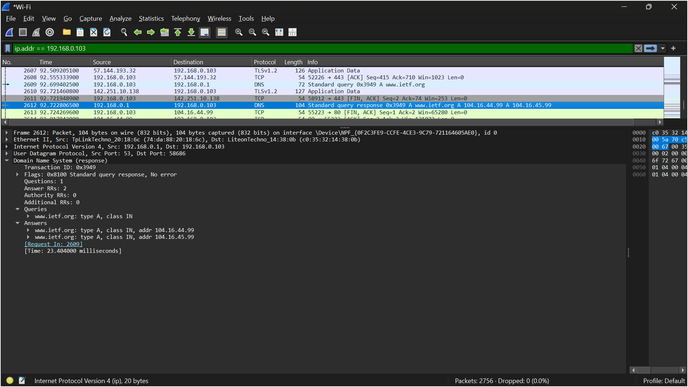
6. Perhatikan paket TCP SYN yang selanjutnya dikirimkan oleh host Anda. Apakah alamat IP pada paket tersebut sesuai dengan alamat IP yang tertera pada pesan balasan DNS?
    - Jawab: Berdasarkan hasil analisis pada Wireshark, paket TCP SYN yang dikirim oleh host memiliki alamat IP tujuan 104.16.44.99. Alamat IP tersebut sesuai dengan salah satu alamat IP yang diperoleh dari pesan balasan DNS sebelumnya, yaitu 104.16.44.99. Dengan demikian, dapat disimpulkan bahwa host menggunakan hasil resolusi DNS untuk melakukan koneksi TCP ke server tujuan, sehingga alamat IP pada paket TCP SYN sesuai dengan alamat IP yang diberikan pada DNS response.
    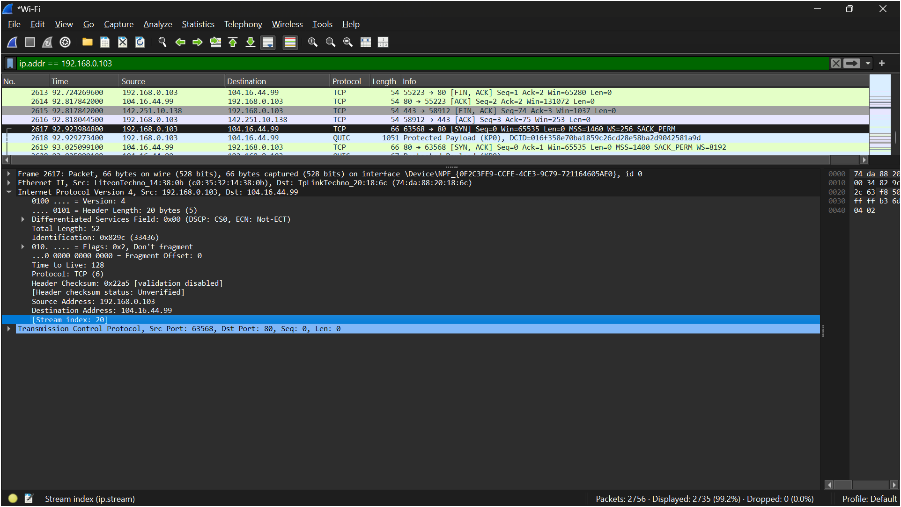
7. Halaman web yang sebelumnya anda akses (http://www.ietf.org) memuat beberapa gambar. Apakah host Anda perlu mengirimkan pesan permintaan DNS baru setiap kali ingin mengakses suatu gambar?
    - Jawab:Berdasarkan hasil tangkapan Wireshark yang telah difilter menggunakan DNS, terlihat bahwa terdapat beberapa permintaan DNS untuk domain yang berbeda seperti www.ietf.org, static.ietf.org, dan domain lainnya. Hal ini menunjukkan bahwa host tidak selalu mengirimkan permintaan DNS baru untuk domain yang sama, karena hasil resolusi DNS dapat disimpan (cache) oleh sistem. Namun, ketika halaman web memuat sumber daya dari domain yang berbeda, maka host akan mengirimkan permintaan DNS baru untuk domain tersebut. Dengan demikian, dapat disimpulkan bahwa permintaan DNS tidak dilakukan untuk setiap gambar jika domainnya sama, tetapi akan dilakukan kembali jika sumber daya berasal dari domain yang berbeda.
    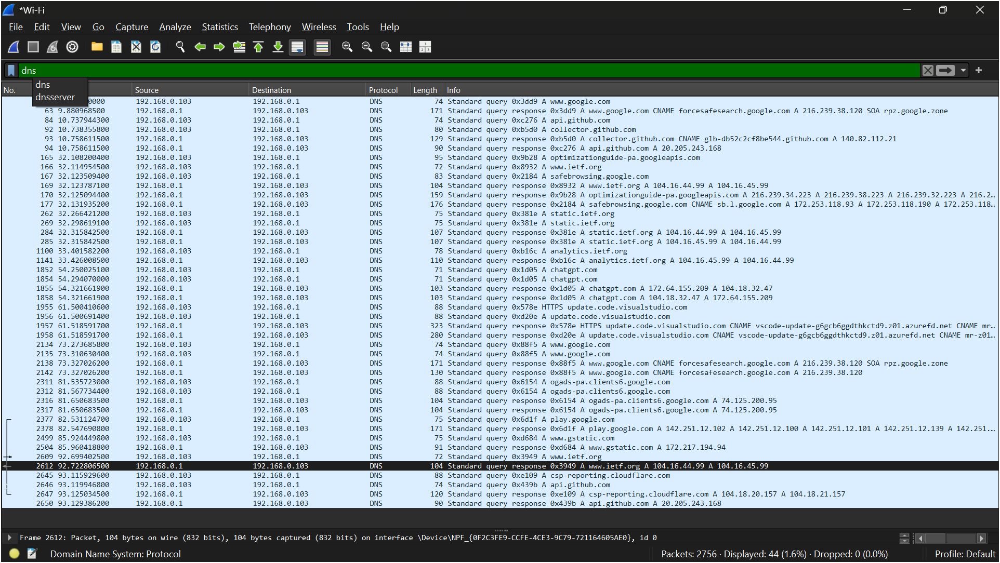

**Langkah-langkah percobaan 2:**