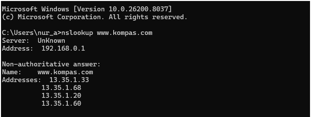
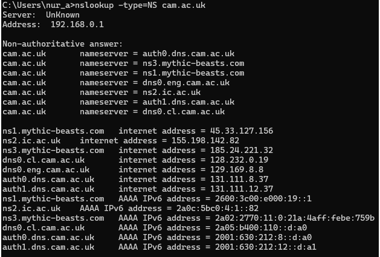
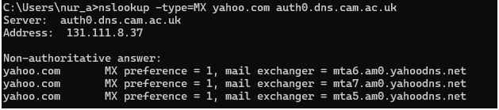

# LAPORAN PRAKTIKUM JARKOM MODUL 4 DNS

Nama: Nur Aisyah Luhur Pambudi
Kelas: IF-04-02

## 4.2 Nslookup
**Pertanyaan:**
1. Jalankan nslookup untuk mendapatkan alamat IP dari server web di Asia. Berapa alamat IP server tersebut?
2. Jalankan nslookup agar dapat mengetahui server DNS otoritatif untuk universitas di Eropa.
3. Jalankan nslookup untuk mencari tahu informasi mengenai server email dari Yahoo! Mail melalui salah satu server yang didapatkan di pertanyaan nomor 2. Apa alamat IP-nya?

**Jawaban:**
1. Dari pengujian yang dilakukan dihasilkan:
    - Tujuan: Mengetahui alamat IP dari server web di wilayah Asia menggunakan perintah nslookup.
    - Hasil:Domain *www.kompas.com* berhasil diterjemahkan menjadi beberapa alamat IP yaitu 13.35.1.33, 13.35.1.68, 13.35.1.20, dan 13.35.1.60. Domain tersebut merupakan website berbasis di Indonesia sehingga termasuk dalam wilayah Asia.
    - DNS Resolver: Permintaan diproses melalui DNS resolver lokal dengan alamat 192.168.0.1.

2. Berdasarkan pengujian menggunakan perintah nslookup -type=NS cam.ac.uk, didapatkan informasi sebagai berikut:
Identifikasi Server Otoritatif: Terdapat beberapa name server yang mengelola domain cam.ac.uk, di antaranya auth0.dns.cam.ac.uk, auth1.dns.cam.ac.uk, dns0.eng.cam.ac.uk, dns0.cl.cam.ac.uk, ns1.mythic-beasts.com, ns3.mythic-beasts.com, dan ns2.ic.ac.uk.
Alamat IP Server (IPv4):Beberapa server memiliki alamat IPv4 seperti 131.111.8.37, 131.111.12.37, 128.232.0.19, 129.169.8.8, serta alamat lain dari server eksternal seperti 45.33.127.156 dan 185.244.221.32.
Dukungan Dual-Stack (IPv6): Server DNS mendukung IPv6 yang ditunjukkan dengan adanya alamat IPv6 seperti 2001:630:212:8::a0 dan lainnya.
DNS Resolver Lokal: Permintaan DNS diproses melalui DNS resolver lokal dengan alamat 192.168.0.1.

3. Dari pengujian yang dilakukan dihasilkan:
Server yang digunakan: Server DNS yang digunakan adalah auth0.dns.cam.ac.uk dengan alamat IP 131.111.8.37.
Masalah: Permintaan query terhadap domain yahoo.com berhasil diproses dan menghasilkan informasi mail server Yahoo tanpa mengalami error.
Penyebab: Hal ini terjadi karena server DNS tersebut mampu merespon permintaan dan memberikan informasi Mail Exchange (MX) dari domain yahoo.com, seperti mta6.am0.yahoodns.net, mta7.am0.yahoodns.net, dan mta5.am0.yahoodns.net. Server DNS tersebut dapat melakukan resolusi domain meskipun domain yang diminta berada di luar otoritasnya.

## 4.3 Ipconfig