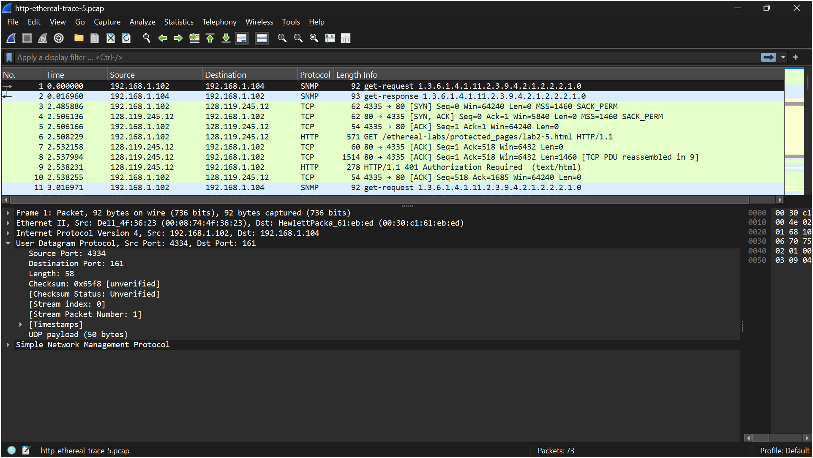
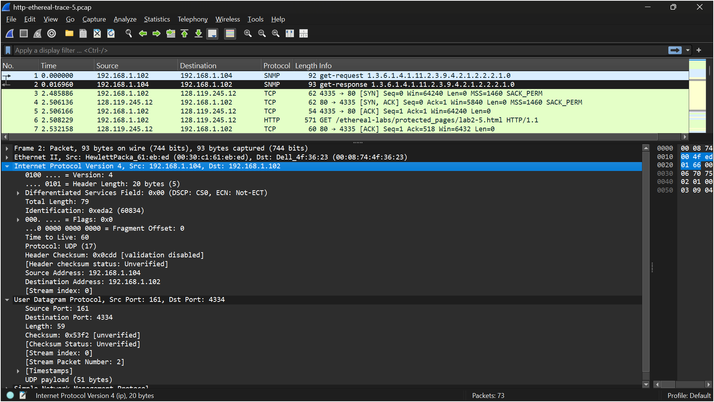
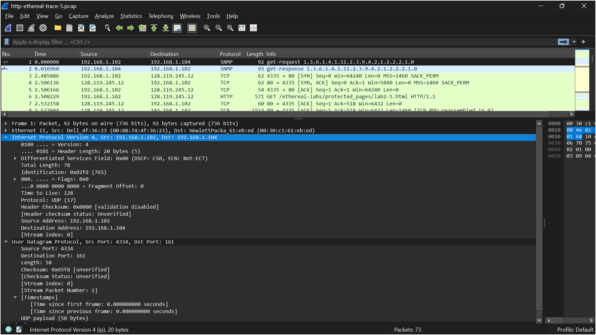

# LAPORAN PRAKTIKUM JARKOM MODUL 5 UDP

Nama: Nur Aisyah Luhur Pambudi
Kelas: IF-04-02

## Langkah-langkah:
1. Unduh zip ini *http://gaia.cs.umass.edu/wireshark-labs/wireshark-traces.zip*.
2. Cari 'http-ethereal-trace-5', lalu ekstrak file.
3. Tambahkan ".pcap" dibelakang nama file agar bisa dibuka di wireshark.
4. Buka file 'http-ethereal-trace-5' di wireshark.
5. Gunakan filter "udp" untuk menampilkan UDP saja di jendela daftar paket.

## Pertanyaan:
1. Pilih satu paket UDP yang terdapat pada trace Anda. Dari paket tersebut, berapa banyak “field” yang terdapat pada header UDP? Sebutkan nama-nama field yang Anda temukan!
    - Jawab: Header UDP memiliki 4 field, yaitu:
                - Source Port
                - Destination Port
                - Length
                - Checksum
    
2. Perhatikan informasi “content field” pada paket yang Anda pilih di pertanyaan 1. Berapa panjang (dalam satuan byte) masing-masing “field” yang terdapat pada header UDP?
    - Jawab: Total panjang header UDP = 8 byte, dapat dilihat dari:
                - Source Port = 2 byte
                - Destination Port = 2 byte
                - Length = 2 byte
                - Checksum = 2 byte
    
3. Nilai yang tertera pada ”Length” menyatakan nilai apa? Verfikasi jawaban Anda melalui paket UDP pada trace.
    - Jawab: Nilai Length menunjukkan total panjang paket UDP (header + payload/data). Pada hasil trace terlihat Length = 58 byte, yang terdiri dari header (8 byte) dan data (50 byte).
    
4. Berapa jumlah maksimum byte yang dapat disertakan dalam payload UDP? (Petunjuk: jawaban untuk pertanyaan ini dapat ditentukan dari jawaban Anda untuk pertanyaan 2)
    - Jawab: Ukuran maksimum UDP adalah 65535 byte, dan header UDP sebesar 8 byte. Sehingga maksimum payload adalah "65535 – 8 = 65527 byte".
    
5. Berapa nomor port terbesar yang dapat menjadi port sumber? (Petunjuk: lihat petunjuk pada pertanyaan 4)
    - Jawab: Port UDP menggunakan 16 bit, sehingga nilai maksimum adalah 65535.
    
6. Berapa nomor protokol untuk UDP? Berikan jawaban Anda dalam notasi heksadesimal dan desimal. Untuk menjawab pertanyaan ini, Anda harus melihat ke bagian ”Protocol” pada datagram IP yang mengandung segmen UDP.
    - Jawab: Berdasarkan hasil pengamatan pada bagian Internet Protocol (IPv4) di Wireshark, terlihat bahwa nilai Protocol yang digunakan adalah UDP dengan nilai 17. Dengan demikian, nomor protokol UDP dalam bentuk desimal adalah 17, sedangkan dalam bentuk heksadesimal adalah 0x11.
    
7. Periksa pasangan paket UDP di mana host Anda mengirimkan paket UDP pertama dan paket UDP kedua merupakan balasan dari paket UDP yang pertama. (Petunjuk: agar paket kedua merupakan balasan dari paket pertama, pengirim paket pertama harus menjadi tujuan dari paket kedua). Jelaskan hubungan antara nomor port pada kedua paket tersebut!
    - Jawab: Berdasarkan hasil pengamatan pada dua paket UDP yang saling berpasangan (request dan response), terlihat bahwa pada paket pertama digunakan source port 4334 dan destination port 161. Kemudian pada paket balasannya, nilai port tersebut tertukar, yaitu source port menjadi 161 dan destination port menjadi 4334. Hal ini menunjukkan bahwa pada komunikasi UDP, port sumber dan port tujuan pada paket balasan merupakan kebalikan dari paket permintaan, sehingga memungkinkan kedua host saling mengenali dan merespons komunikasi dengan benar.
    
    