# LAPORAN PRAKTIKUM JARKOM MODUL 6 TCP

Nama: Nur Aisyah Luhur Pambudi
Kelas: IF-04-02

## 6.2 Menangkap Tansfer TCP dalam Jumlah Besar dari Komputer Pribadi ke Remote Server 
**Langkah-langkah:**
1. Buka URL Buka *http://gaia.cs.umass.edu/wireshark-labs/alice.txt* (pastikan harus http bukan https).
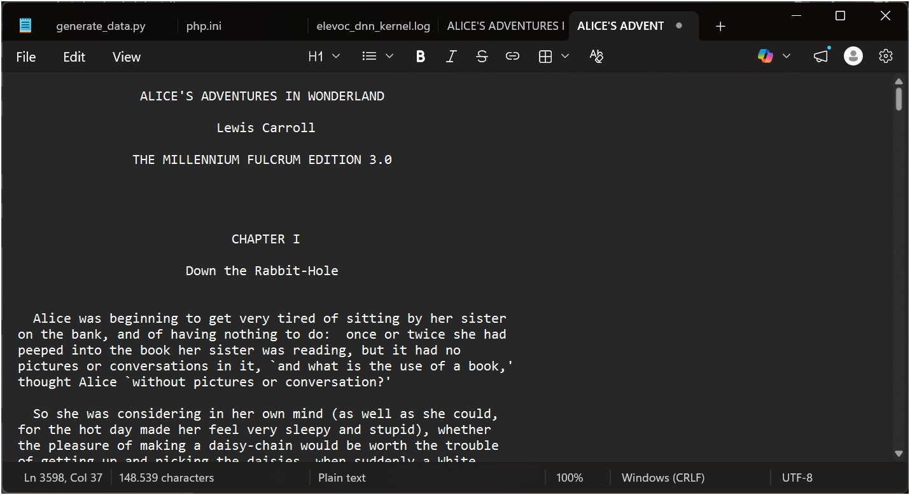
2. Salin seluruh text Alice ke notepad dan simpan.
3. Setelah itu buka URL *http://gaia.cs.umass.edu/wireshark-labs/TCP-wireshark-file1.html*, nanti tampilannya akan seperti ini.
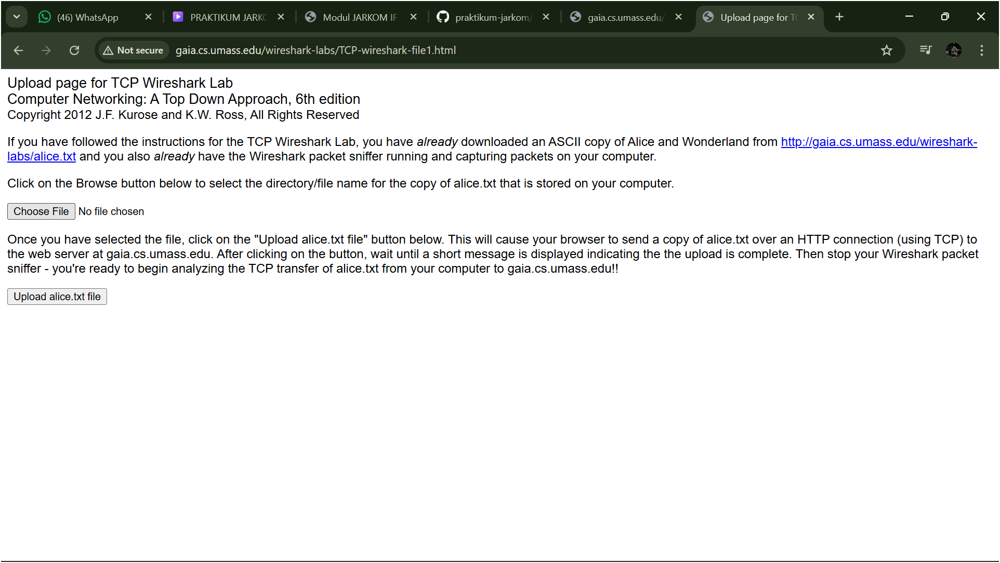
4. Pilih "choose file" untuk memilih file Alice yang sudah disimpan tadi.
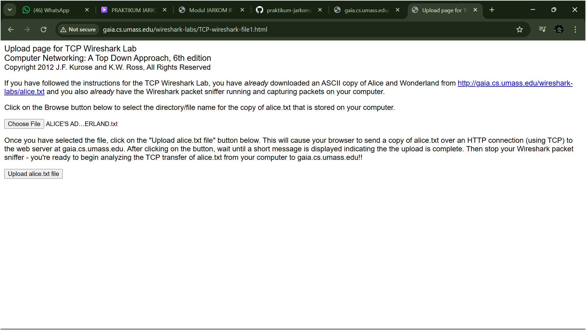
5. Mulai capture wireshark, tunggu beberapa saat lalu pilih "upload file". Nanti akan muncul seperti gambar ini.
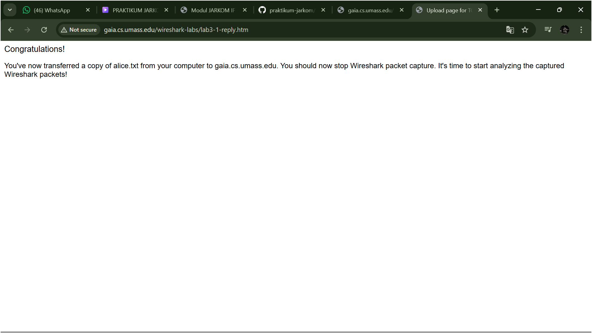
6.Stop capturing packets, dan hasilnya akan seperti ini.
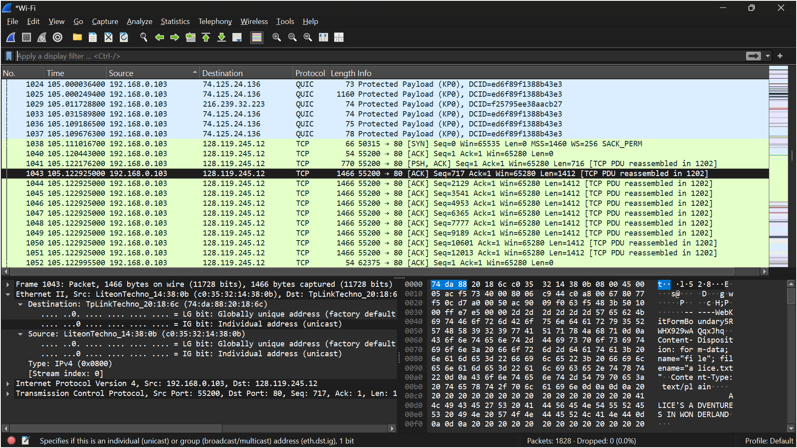

## 6.3 Tampilan Awal pada Captured Trace
**Langkah-langkah:**
1. Unduh Trace zip di http://gaia.cs.umass.edu/wireshark-labs/wireshark-traces.zip. Lalu ekstrak.
2. Cari file tcp-ethereal-trace-1 lalu tambahkan pcap dibagian belakangnya (tcp-ethereal-trace-1.pcap) agar bisa dibuka di wireshark.
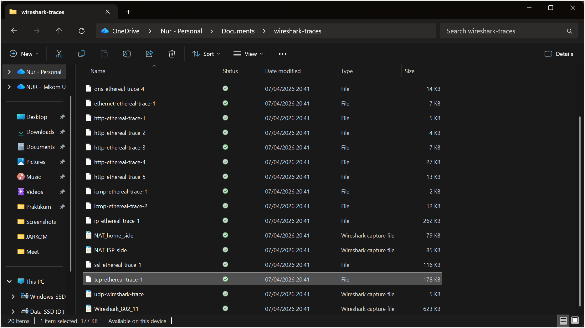
3. Buka file di wireshark dan akan muncul Three-way hanshake seperti ini.
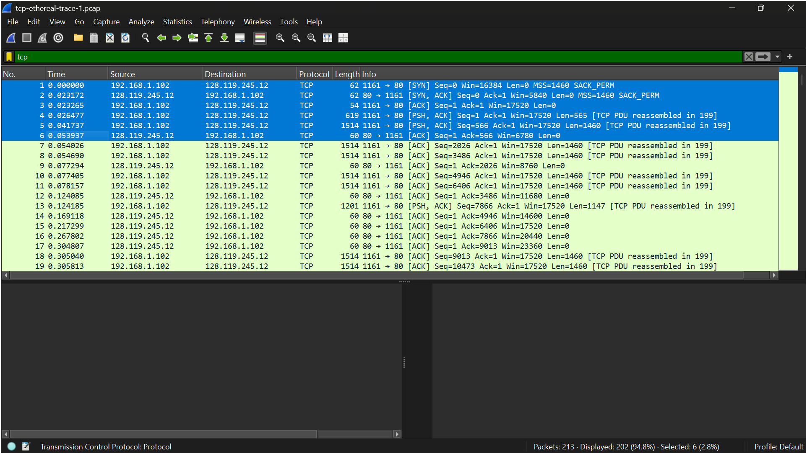

**Pertanyaan:**
1. Berapa alamat IP dan nomor port TCP yang digunakan oleh komputer klien (sumber) untuk mentransfer file ke gaia.cs.umass.edu? Cara paling mudah menjawab pertanyaan ini adalah dengan memilih sebuah pesan HTTP dan meneliti detail paket TCP yang digunakan untuk membawa pesan HTTP tersebut.
*Jawab: Alamat IP komputer klien adalah 192.168.1.102 dan nomor port TCP yang digunakan adalah 1161 untuk mentransfer data ke server gaia.cs.umass.edu.*
2. Apa alamat IP dari gaia.cs.umass.edu? Pada nomor port berapa ia mengirim dan menerima segmen TCP untuk koneksi ini?
*Jawab: Alamat IP dari gaia.cs.umass.edu adalah 128.119.245.12. Server menggunakan nomor port 80 untuk mengirim dan menerima segmen TCP dalam koneksi ini.*

## 6.4 HTML Documents dengan Embedded Objects
**A. Langkah-langkah:**
1. Bersihkan cache browser terlebih dahulu.
2. Mulai capture paket.
3. Buka URL *http://gaia.cs.umass.edu/wireshark-labs/HTTPwireshark-file4.html*.
4. Jika sudah dibuka URL-nya, lalu beralih lagi ke Wireshark dan stop capturing packets (logo stop bewarna merah).
5. Gunakan filter "http" untuk menampilkan http saja di jendela daftar paket.

**B. Hasil:**
1. Tampilan URL
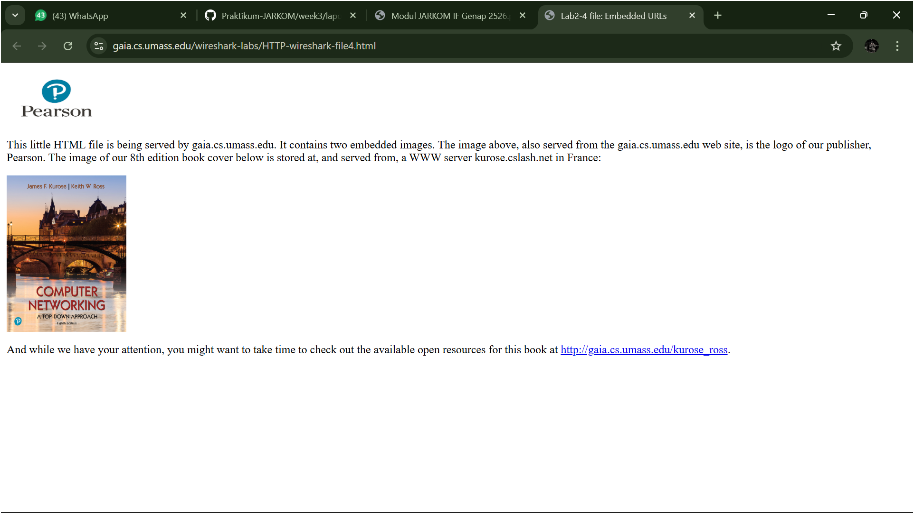
2. Jendela daftar paket
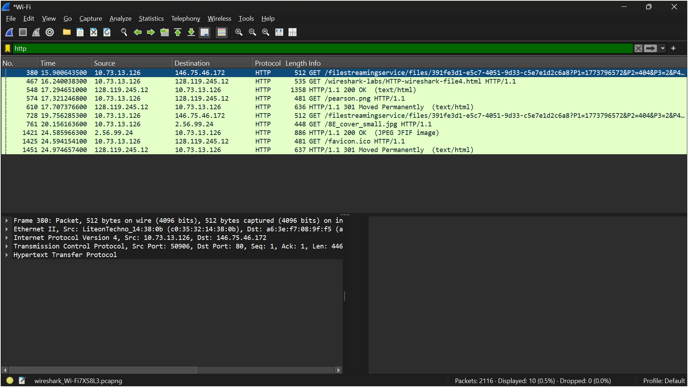

## 6.5 HTT Authentication
**A. Langkah-langkah:**
1. Bersihkan cache browser terlebih dahulu.
2. Mulai capture paket.
3. Buka URL *http://gaia.cs.umass.edu/wireshark-labs/HTTPwireshark-file4.html*.
4. Ketikkan username: "wireshark-students" dan passwordnya: network pada pop up yang muncul saat membuka URL.
4. Jika sudah, lalu beralih lagi ke Wireshark dan stop capturing packets (logo stop bewarna merah).
5. Gunakan filter "http" untuk menampilkan http saja di jendela daftar paket.

**B. Hasil:**
1. Tampilan pop-up
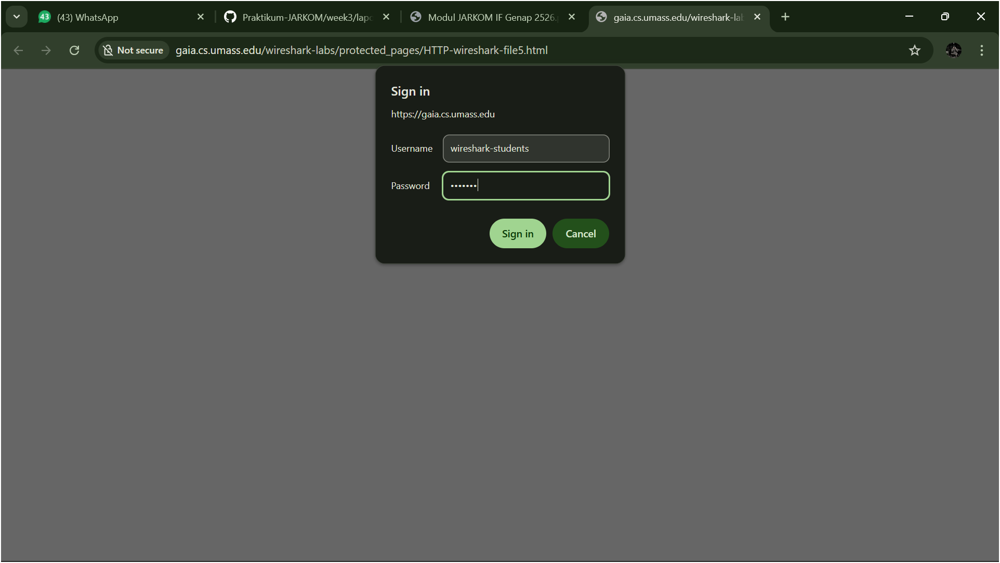
2. Tampilan URL
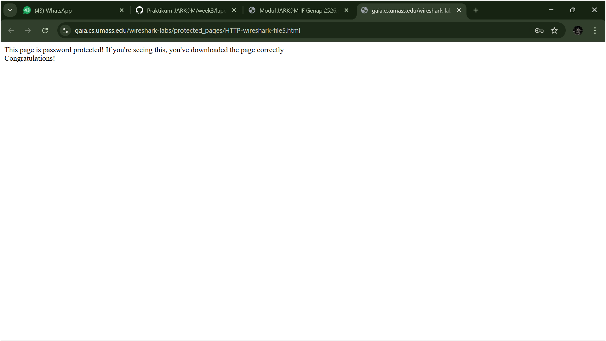
3. Jendela daftar paket
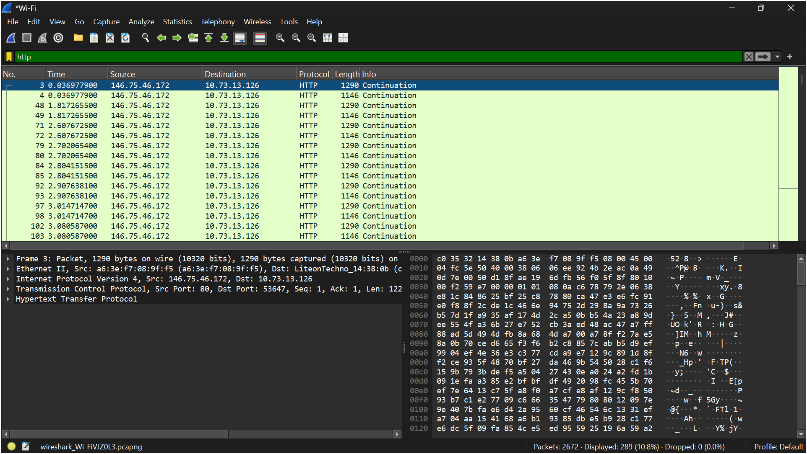