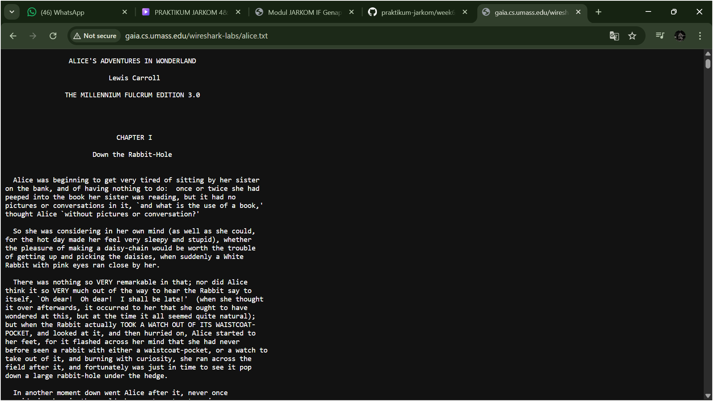
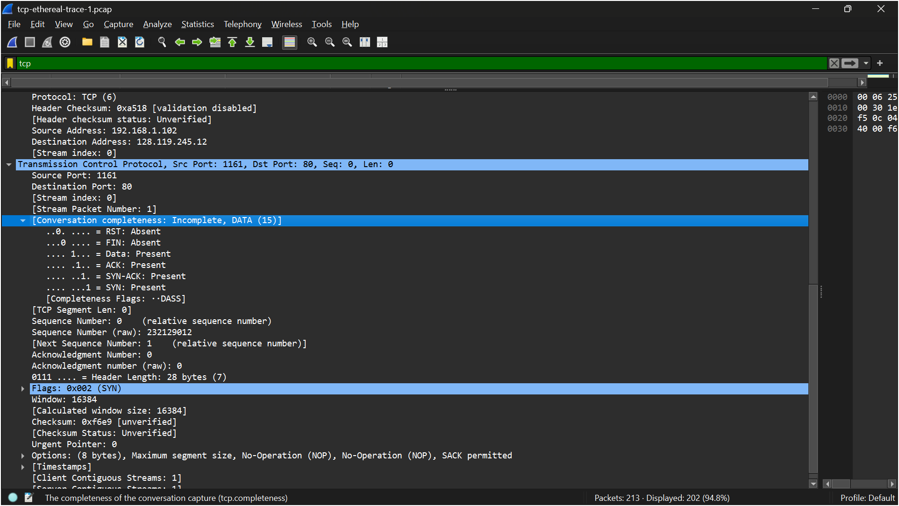
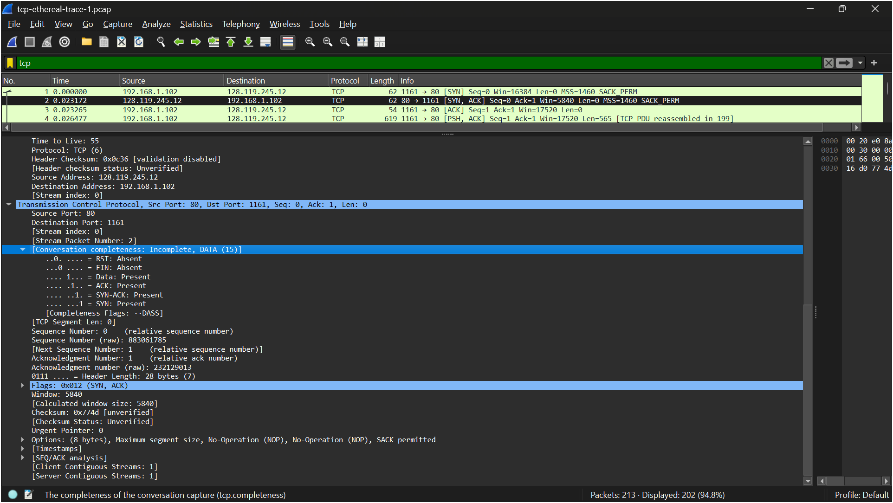
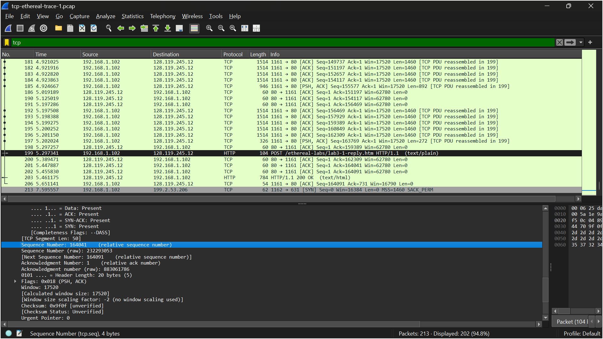
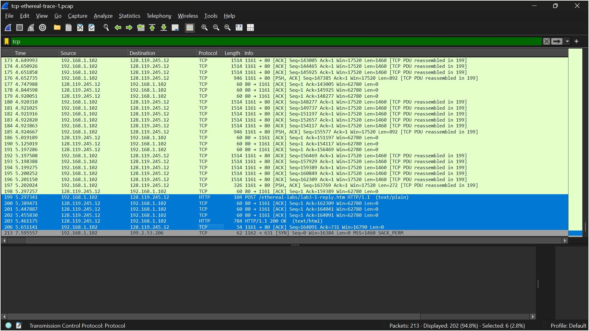
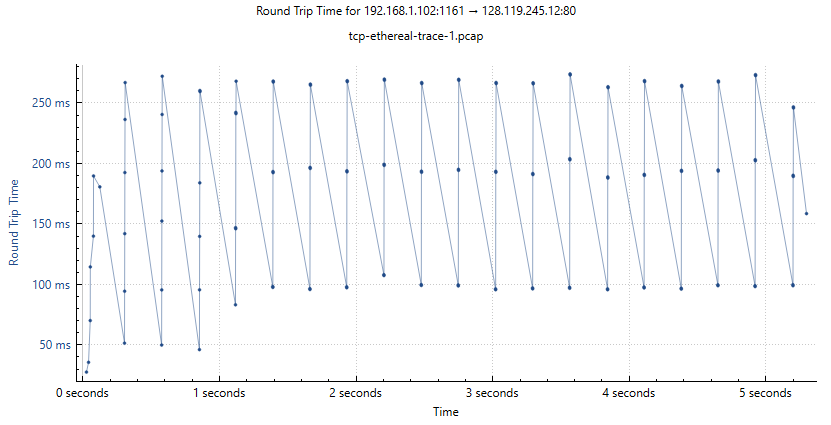
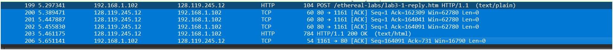
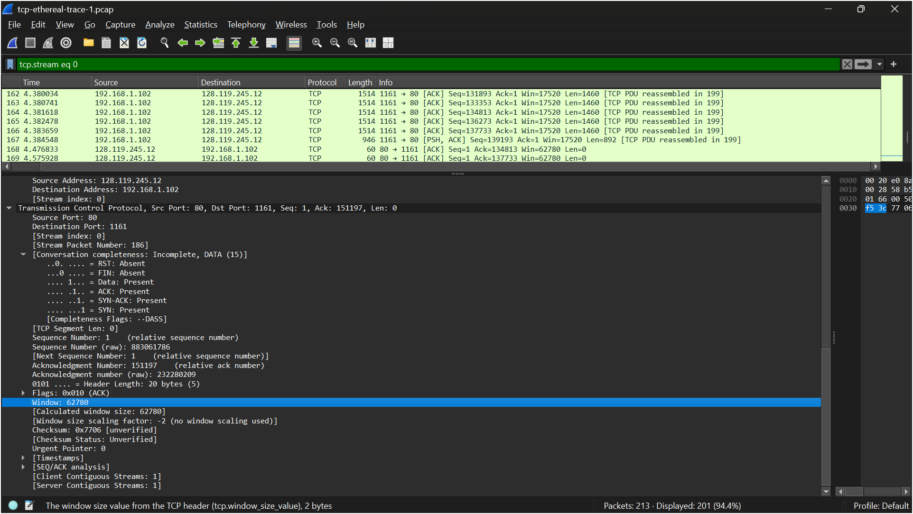
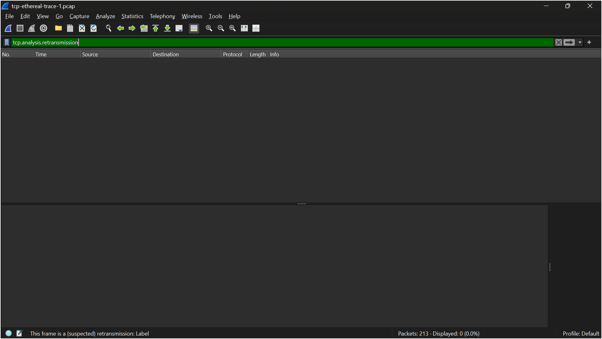
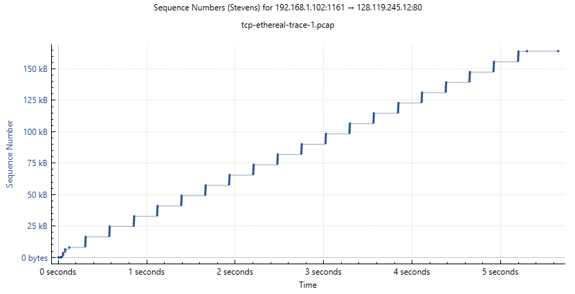

# LAPORAN PRAKTIKUM JARKOM MODUL 6 TCP

Nama: Nur Aisyah Luhur Pambudi
Kelas: IF-04-02

## 6.2 Menangkap Tansfer TCP dalam Jumlah Besar dari Komputer Pribadi ke Remote Server 
**Langkah-langkah:**
1. Buka URL Buka *http://gaia.cs.umass.edu/wireshark-labs/alice.txt* (pastikan harus http bukan https).

2. Salin seluruh text Alice ke notepad dan simpan.

3. Setelah itu buka URL *http://gaia.cs.umass.edu/wireshark-labs/TCP-wireshark-file1.html*, nanti tampilannya akan seperti ini.

4. Pilih "choose file" untuk memilih file Alice yang sudah disimpan tadi.

5. Mulai capture wireshark, tunggu beberapa saat lalu pilih "upload file". Nanti akan muncul seperti gambar ini.

6.Stop capturing packets, dan hasilnya akan seperti ini.

## 6.3 Tampilan Awal pada Captured Trace
**Langkah-langkah:**
1. Unduh Trace zip di http://gaia.cs.umass.edu/wireshark-labs/wireshark-traces.zip. Lalu ekstrak.
2. Cari file tcp-ethereal-trace-1 lalu tambahkan pcap dibagian belakangnya (tcp-ethereal-trace-1.pcap) agar bisa dibuka di wireshark.

3. Buka file di wireshark dan akan muncul Three-way hanshake seperti ini.

**Pertanyaan:**
1. Berapa alamat IP dan nomor port TCP yang digunakan oleh komputer klien (sumber) untuk mentransfer file ke gaia.cs.umass.edu? Cara paling mudah menjawab pertanyaan ini adalah dengan memilih sebuah pesan HTTP dan meneliti detail paket TCP yang digunakan untuk membawa pesan HTTP tersebut.
2. Apa alamat IP dari gaia.cs.umass.edu? Pada nomor port berapa ia mengirim dan menerima segmen TCP untuk koneksi ini?

**Jawaban:**
1. Jawab: Alamat IP komputer klien adalah 192.168.1.102 dan nomor port TCP yang digunakan adalah 1161 untuk mentransfer data ke server gaia.cs.umass.edu.
2. Alamat IP dari gaia.cs.umass.edu adalah 128.119.245.12. Server menggunakan nomor port 80 untuk mengirim dan menerima segmen TCP dalam koneksi ini.

## 6.4 HTML Documents dengan Embedded Objects
**Pertanyaan:**
1. Berapa nomor urut segmen TCP SYN yang digunakan untuk memulai sambungan TCP antara komputer klien dan gaia.cs.umass.edu? Apa yang dimiliki segmen tersebut sehingga teridentifikasi sebagai segmen SYN?
2. Berapa nomor urut segmen SYNACK yang dikirim oleh gaia.cs.umass.edu ke komputer klien sebagai balasan dari SYN? Berapa nilai dari field Acknowledgement pada segmen SYNACK? Bagaimana gaia.cs.umass.edu menentukan nilai tersebut? Apa yang dimiliki oleh segmen sehingga teridentifikasi sebagai segmen SYNACK?
3. Berapa nomor urut segmen TCP yang berisi perintah HTTP POST? Perhatikan bahwa untuk menemukan perintah POST, Anda harus menelusuri content field milik paket di bagian bawah jendela Wireshark, kemudian cari segmen yang berisi "POST" di bagian field DATAnya.
4. Anggap segmen TCP yang berisi HTTP POST sebagai segmen pertama dalam koneksi TCP. Berapa nomor urut dari enam segmen pertama dalam TCP (termasuk segmen yang berisi HTTP POST)? Pada jam berapa setiap segmen dikirim? Kapan ACK untuk setiap segmen diterima? Dengan adanya perbedaan antara kapan setiap segmen TCP dikirim dan kapan acknowledgement-nya diterima, berapakah nilai RTT untuk keenam segmen tersebut?Berapa nilai EstimatedRTT setelah penerimaan setiap ACK? (Catatan: Wireshark memiliki fitur yang memungkinkan Anda untuk memplot RTT untuk setiap segmen TCP yang dikirim. Pilih segmen TCP yang dikirim dari klien ke server gaia.cs.umass.edu pada jendela "daftar JARINGAN KOMPUTER 36 paket yang ditangkap". Kemudian pilih: Statistics->TCP Stream Graph- >Round Trip Time Graph).
5. Berapa panjang setiap enam segmen TCP pertama?
6. Berapa jumlah minimum ruang buffer tersedia yang disarankan kepada penerima dan diterima untuk seluruh trace? Apakah kurangnya ruang buffer penerima pernah menghambat pengiriman?
7. Apakah ada segmen yang ditransmisikan ulang dalam file trace? Apa yang anda periksa (di dalam file trace) untuk menjawab pertanyaan ini?

**Jawaban:**
1. Nomor urut (sequence number) dari segmen TCP SYN yang digunakan untuk memulai koneksi adalah 0 (relative sequence number). Hal ini terlihat pada bagian Transmission Control Protocol di Wireshark. Segmen tersebut dapat diidentifikasi sebagai segmen SYN karena memiliki flag SYN yang aktif, yang berfungsi untuk memulai koneksi TCP dalam proses three-way handshake.

2. Nomor urut (sequence number) dari segmen SYN-ACK yang dikirim oleh gaia.cs.umass.edu adalah 0, sedangkan nilai acknowledgement-nya adalah 1. Nilai acknowledgement tersebut diperoleh dari sequence number segmen SYN milik klien yang bernilai 0, kemudian ditambah 1 sebagai tanda bahwa segmen SYN telah diterima. Segmen ini dapat diidentifikasi sebagai SYN-ACK karena memiliki kedua flag SYN dan ACK yang aktif, yang menunjukkan bahwa segmen tersebut merupakan balasan dari permintaan koneksi sekaligus konfirmasi penerimaan SYN dari klien.

3. Nomor urut (sequence number) dari segmen TCP yang berisi perintah HTTP POST adalah 164041. Hal ini terlihat pada paket dengan informasi “POST /ethereal-labs/lab3-1-reply.htm” di Wireshark. Segmen tersebut dapat diidentifikasi melalui field DATA pada bagian bawah yang menampilkan perintah POST. Segmen ini merupakan bagian awal dari pengiriman data dari klien ke server setelah koneksi TCP terbentuk, sehingga sequence number tersebut digunakan sebagai acuan dalam proses transfer data TCP.

4. Segmen pertama adalah segmen HTTP POST pada waktu 5.297341 dengan sequence number 164041. Lima segmen berikutnya dikirim pada waktu 5.389471, 5.447887, 5.455830, 5.461175, dan 5.651141. ACK untuk segmen-segmen tersebut diterima dari server pada waktu yang berdekatan, yaitu sekitar 5.389471 hingga 5.651141, dengan nilai acknowledgement yang meningkat sesuai data yang diterima. Berdasarkan selisih waktu antara pengiriman segmen dan penerimaan ACK, nilai RTT berada pada kisaran sekitar 100 ms hingga 270 ms, sebagaimana terlihat pada grafik Round Trip Time. Nilai RTT tersebut menunjukkan adanya fluktuasi namun tetap stabil selama komunikasi berlangsung. Dengan kondisi RTT yang relatif konstan, nilai EstimatedRTT setelah penerimaan setiap ACK juga cenderung stabil dan tidak mengalami perubahan yang signifikan, sehingga mencerminkan performa jaringan yang baik tanpa adanya gangguan atau delay yang ekstrem.

5. Panjang enam segmen TCP pertama adalah 104 byte, 0 byte, 0 byte, 0 byte, 784 byte, dan 0 byte. Nilai tersebut menunjukkan bahwa hanya beberapa segmen yang membawa data, sedangkan segmen lainnya merupakan acknowledgment yang tidak membawa payload sehingga bernilai 0 byte.

6. Jumlah minimum ruang buffer yang tersedia yang diiklankan oleh penerima dapat dilihat dari nilai window size pada segmen TCP, yaitu sebesar 62780 byte. Nilai ini menunjukkan kapasitas buffer yang tersedia di sisi penerima untuk menerima data. Berdasarkan hasil pengamatan pada seluruh trace, tidak terlihat adanya penurunan window size yang signifikan, sehingga dapat disimpulkan bahwa keterbatasan ruang buffer penerima tidak menghambat proses pengiriman data selama komunikasi TCP berlangsung.

7. Tidak terdapat segmen TCP yang ditransmisikan ulang (retransmission) pada file trace. Hal ini dibuktikan dengan penggunaan filter “tcp.analysis.retransmission” pada Wireshark yang tidak menampilkan paket apa pun. Dengan demikian, dapat disimpulkan bahwa tidak terjadi kehilangan paket atau gangguan jaringan selama proses komunikasi TCP berlangsung.

## 6.5 HTT Authentication
**Pertanyaan:**
1. Gunakan alat plotting Time-Sequence-Graph (Stevens) untuk melihat grafik nomor urut berbanding waktu dari segmen yang dikirim oleh klien ke server gaia.cs.umass.edu. Dapatkah Anda mengidentifikasi di mana fase “slow start” TCP dimulai dan berakhir, dan pada bagian mana algoritma ”congestion avoidance” mengambil alih? Berikan komentar tentang bagaimana data yang diukur berbeda dari perilaku ideal TCP yang telah kita pelajari.

**Jawaban:**
1. Berdasarkan grafik Time-Sequence Graph (Stevens), terlihat bahwa pada awal waktu terjadi peningkatan sequence number yang cukup cepat, yang menunjukkan fase slow start TCP dimulai sejak awal pengiriman data hingga sekitar detik pertama. Setelah itu, peningkatan sequence number menjadi lebih stabil dan cenderung linear, yang menunjukkan bahwa algoritma congestion avoidance mulai mengambil alih. Hal ini terlihat dari pola grafik yang membentuk kenaikan bertahap seperti tangga. Dibandingkan dengan perilaku ideal TCP, yang biasanya menunjukkan peningkatan eksponensial yang sangat jelas pada fase slow start, grafik yang diperoleh menunjukkan peningkatan yang lebih halus dan tidak terlalu tajam. Perbedaan ini kemungkinan disebabkan oleh kondisi jaringan yang stabil serta ukuran data yang tidak terlalu besar, sehingga transisi antara slow start dan congestion avoidance tidak terlihat secara drastis.
