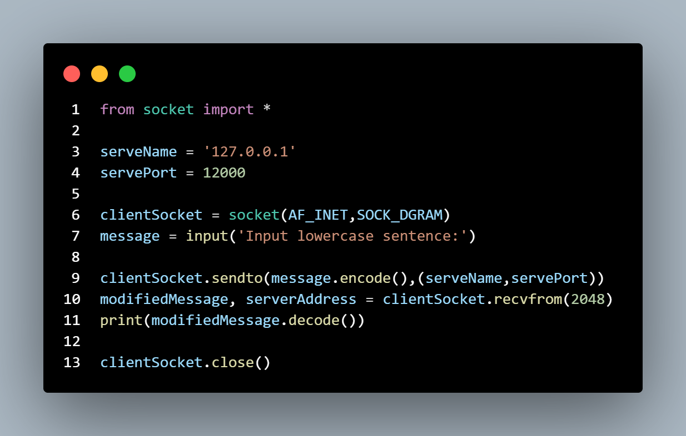
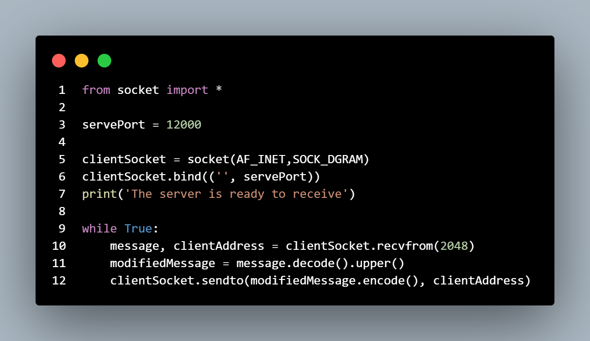
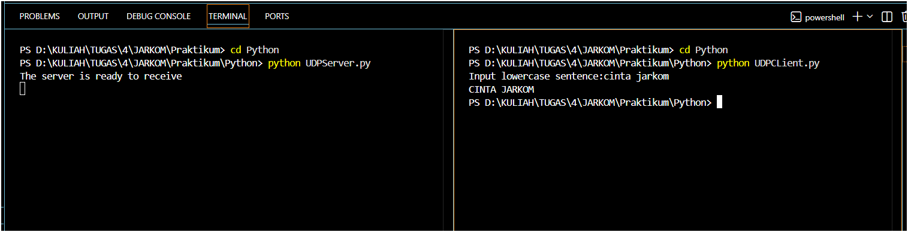
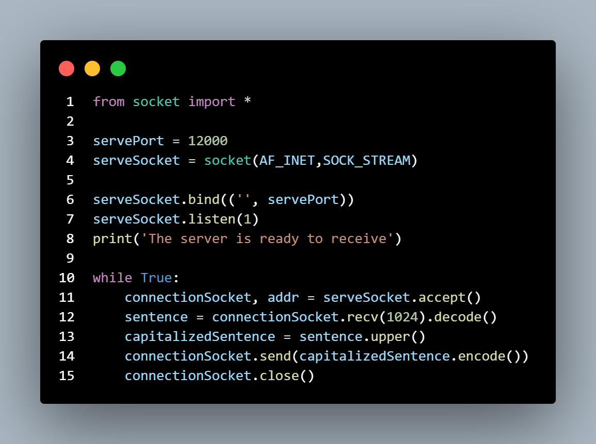
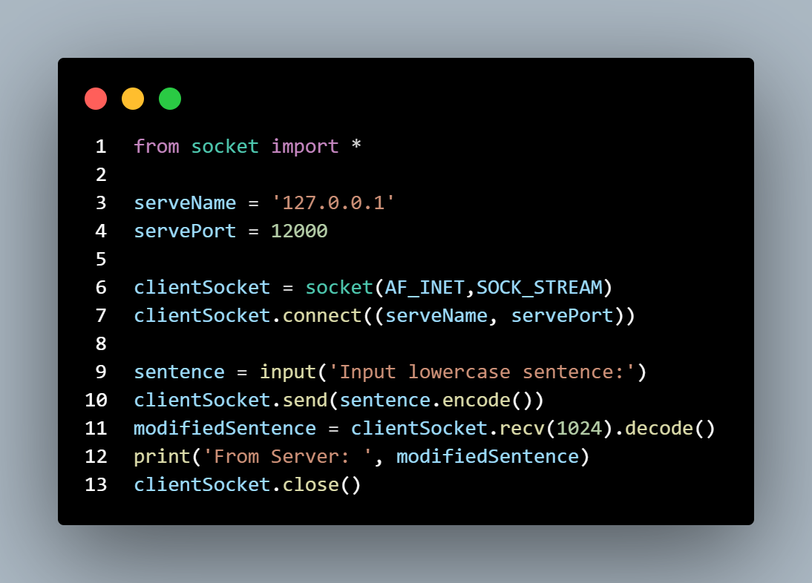
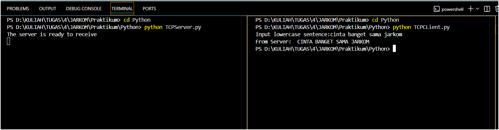

# LAPORAN PRAKTIKUM JARKOM MODUL 7 SOCKET PROGRAMMING: MEMBUAT APLIKASI JARINGAN 

Nama: Nur Aisyah Luhur Pambudi
Kelas: IF-04-02

## 7.2 Program Socket dengan UDP
**Langkah-langkah:**
1. Pertama, client membuat socket menggunakan *socket(AF_INET, SOCK_DGRAM)* yang berfungsi sebagai media komunikasi. *AF_INET* menunjukkan penggunaan IPv4, sedangkan *SOCK_DGRAM* menandakan bahwa protokol yang digunakan adalah UDP (connectionless).
2. Client kemudian menentukan alamat tujuan yaitu IP server (*127.0.0.1*) dan port (*12000*) sebagai tujuan pengiriman data.
3. Client mengambil input dari pengguna menggunakan *input()*, yang nantinya akan dikirim ke server sebagai pesan.
4. Pesan tersebut diubah ke bentuk byte menggunakan *.encode*()*, kemudian dikirim ke server melalui fungsi *sendto()*, yang secara langsung menyertakan alamat tujuan tanpa perlu membangun koneksi terlebih dahulu.
5. Di sisi server, socket dibuat dengan cara yang sama yaitu menggunakan *socket(AF_INET, SOCK_DGRAM)*, kemudian diikat ke port tertentu menggunakan *bind()*, sehingga server dapat menerima data yang masuk ke port tersebut.
6. Server masuk ke dalam perulangan *while True*, yang memungkinkan server untuk terus menerima data dari client tanpa berhenti.
7. Ketika data diterima menggunakan *recvfrom()*, server juga mendapatkan alamat client (IP dan port), yang nantinya digunakan sebagai tujuan untuk mengirim balasan.
8. Data yang diterima kemudian diubah dari byte ke string menggunakan *.decode()*, lalu diproses dengan fungsi *.upper()* untuk mengubah seluruh huruf menjadi kapital.
9. Hasil yang telah diproses dikembalikan ke client menggunakan *sendto()*, setelah terlebih dahulu diubah kembali ke bentuk byte dengan *.encode*()*.
10. Di sisi client, data balasan diterima menggunakan *recvfrom()*, kemudian ditampilkan ke layar setelah diubah kembali menjadi string menggunakan *.decode()*.

**Output:**

## 7.3 Program Socket dengan TCP
**Langkah-langkah:**
1. Pertama, server membuat socket menggunakan *socket(AF_INET, SOCK_STREAM)* yang berfungsi sebagai media komunikasi. *AF_INET* menunjukkan penggunaan IPv4, sedangkan SOCK_STREAM menandakan bahwa protokol yang digunakan adalah TCP (connection-oriented).
2. Server kemudian mengikat socket ke port tertentu menggunakan *bind(('', serverPort))*, sehingga server berjalan pada port 12000 dan siap menerima koneksi dari client.
3. Setelah itu, server menjalankan *listen(1)* yang membuat server mulai menunggu permintaan koneksi dari client dengan antrean maksimal 1 koneksi.
4. Server menampilkan pesan "The server is ready to receive" sebagai tanda bahwa server sudah aktif dan siap menerima koneksi.
5. Server masuk ke dalam perulangan *while True*, yang memungkinkan server terus berjalan dan melayani client tanpa berhenti.
6. Ketika client mencoba terhubung, server menerima koneksi menggunakan *accept()*, yang akan membuat socket baru (connectionSocket) khusus untuk komunikasi dengan client tersebut.
7. Server menerima data dari client menggunakan *recv(1024)*, kemudian mengubahnya dari byte menjadi string dengan *.decode()*.
8. Data yang diterima diproses menggunakan *.upper()* untuk mengubah seluruh huruf menjadi kapital.
9. Hasil yang telah diproses dikirim kembali ke client menggunakan send(), setelah terlebih dahulu diubah ke bentuk byte dengan *.encode()*.
10. Setelah selesai, koneksi dengan client ditutup menggunakan *close()*, namun server tetap berjalan untuk melayani client berikutnya.
11. Di sisi client, socket dibuat menggunakan *socket(AF_INET, SOCK_STREAM)* lalu melakukan koneksi ke server dengan *connect((serverName, serverPort))*.
12. Client mengambil input dari pengguna menggunakan *input()*, kemudian mengirimkannya ke server menggunakan *send()* setelah diubah ke bentuk byte.
13. Client menerima balasan dari server menggunakan *recv(1024)*, lalu mengubahnya kembali menjadi string dengan *.decode()* dan menampilkannya ke layar.

**Output:**
